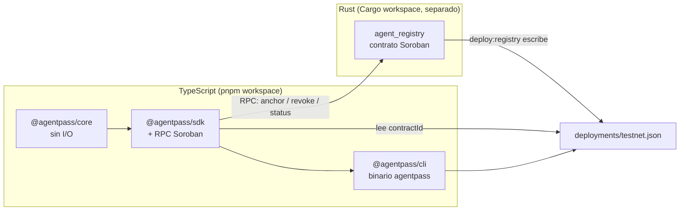

# Arquitectura técnica — AgentPass

> Referencia técnica autocontenida. Pensada para poder copiarse entera en un
> chat nuevo (con o sin acceso al repo) y que quien la lea entienda el sistema
> sin tener que leer el código fuente.
>
> El porqué de cada decisión está en [DECISIONES.md](DECISIONES.md); el avance
> hito a hito en [BITACORA.md](BITACORA.md); qué es el producto y por qué
> existe en [CONTEXTO.md](CONTEXTO.md). Este archivo es el mapa técnico denso;
> los otros son la narrativa.

Última revisión: 2026-09-02 · Estado: T1–T8 completos (piloto cerrado)

---

## 1. Vista de conjunto



Dos mundos deliberadamente separados. `contracts/` es un Cargo workspace
independiente — **no tiene `package.json`**, pnpm no lo ve. El único artefacto
que cruza la frontera es `deployments/testnet.json`, escrito por
`pnpm run deploy:registry` y leído por el SDK. Si algo se rompe entre las dos
mitades, ese es el único lugar donde mirar.

## 2. Estructura del repositorio

```
agentpass/
├── packages/
│   ├── core/     # tipos, did:stellar, VC-JWT sign/verify — sin I/O
│   ├── sdk/      # issue()/verify()/revoke() — core + RPC Soroban
│   └── cli/      # el binario `agentpass`
├── contracts/
│   └── agent-registry/   # contrato Soroban, Cargo workspace propio
├── scripts/      # bootstrap.ts, deploy-registry.ts — fuera de ambos workspaces "públicos"
├── deployments/testnet.json   # único artefacto compartido TS↔Rust
├── examples/scope.json        # archivo de ejemplo para `agentpass issue --scope`
└── docs/         # este árbol de documentos
```

`packages/core` importa **únicamente** desde `@stellar/stellar-sdk/base` (el
subpath sin clientes de Horizon/RPC), así que la restricción "core no hace I/O"
está impuesta por el import, no por disciplina.

## 3. El modelo de identidad — `did:stellar`

Método DID sin resolución de red. Un `did:stellar:testnet:<G-address>` **es**
la llave pública Ed25519 de esa cuenta Stellar, codificada en StrKey. Verificar
una firma nunca requiere red.

```
did:stellar:testnet:GARBTKFQEX325HDOWL3KQT7PDCENLOYMXF7D6B6SB54LDKCHCRYFUY2K
└─┬─┘ └──┬──┘ └──┬──┘ └────────────────────────┬────────────────────────────┘
scheme  method  network            Ed25519 public key, StrKey-encoded
```

Funciones clave (`packages/core/src/did.ts`):

| función | qué hace |
|---|---|
| `stellarAddressToDid(address, network)` | `G...` → `StellarDid` (tipo *branded*) |
| `parseStellarDid(did)` | → `{ did, network, address }`, cada segmento validado |
| `didToPublicKey(did)` | → `Uint8Array` de 32 bytes, la llave cruda para verificar el JWS |

Nada de leniencia: sin `trim`, sin normalización de mayúsculas. Un DID que
difiere en un byte identifica a **otro sujeto**.

## 4. El modelo de credencial — VC-JWT

Perfil: data model **W3C VC 2.0** serializado como **JWS compacto firmado con
EdDSA**. Sin JSON-LD, sin canonicalización, sin Data Integrity proofs.

```json
{
  "@context": ["https://www.w3.org/ns/credentials/v2"],
  "type": ["VerifiableCredential", "AgentPassCredential"],
  "issuer": "did:stellar:testnet:GCTTRJIY...",
  "validFrom": "2026-09-01T00:00:00Z",
  "validUntil": "2026-12-01T00:00:00Z",
  "credentialSubject": {
    "id": "did:stellar:testnet:GAK6E5E7...",
    "agent": { "name": "...", "model": "...", "operator": "..." },
    "principal": "did:stellar:testnet:GCTTRJIY...",
    "scope": {
      "actions": ["catalog:read", "intent:create"],
      "venues": [], "assets": [],
      "limits": { "perTx": "50.00", "perDay": "200.00", "currency": "USDC" }
    }
  },
  "credentialStatus": { "type": "AgentPassRegistry2026", "registry": "C..." }
}
```

Todo el esquema es zod, en `packages/core/src/credential.ts`, con objetos
**estrictos** (un campo desconocido hace fallar la validación). Detalle no
obvio: `credentialStatus` **no** lleva el hash de la propia credencial —
sería circular (firmar cambiaría el hash que se está firmando) e inseguro (un
hash autodeclarado podría apuntar a otra credencial activa). El verificador
siempre calcula `sha256(jws)` sobre el documento que recibió.

`scope.limits` viaja firmado pero **nada lo hace cumplir todavía** — es
declarativo a propósito; el enforcement es una fase futura, fuera de este
piloto.

Header del JWS: `{ "alg": "EdDSA", "typ": "vc+jwt", "kid": "<did del emisor>" }`.
**El `kid` nunca se usa para elegir la llave de verificación** — lo controla
quien construye el JWS, así que confiar en él permitiría que una credencial
falsificada nombrara la llave que la valida. La llave sale siempre de
`issuer` en el payload; `kid` solo se contrasta contra él.

`stellarKeypairToJWK` (`packages/core/src/jwk.ts`): una llave secreta de
Stellar es una **semilla Ed25519 de 32 bytes**, no una llave expandida. El JWK
lleva esa semilla en `d` y la pública en `x`, ambas base64url. Confundirlas, o
usar base64 en vez de base64url, produce llaves que firman sin quejarse y no
verifican contra nada — es el punto de fallo silencioso más peligroso del
proyecto, y está anclado a un vector de prueba externo (RFC 8032 §7.1 TEST 1)
más un cruce contra `@noble/curves`.

## 5. Los tres chequeos de verificación

| # | chequeo | dónde vive | red | código si falla |
|---|---|---|---|---|
| 1 | firma verifica contra la llave del `issuer` | `core` | no | `InvalidSignature` |
| 2 | `now` ∈ [`validFrom`, `validUntil`] | `core` | no | `CredentialExpired` / `CredentialNotYetValid` |
| 3a | `status(sha256(jws)) == Active` | `sdk` → contrato | sí | `CredentialRevoked` / `CredentialUnknown` |
| 3b | el emisor está registrado y activo | `sdk` → contrato | sí | `IssuerNotRegistered` / `IssuerInactive` |

**Orden importante:** la firma se verifica antes que la ventana temporal
—si no, una credencial falsificada *y* vencida se reportaría como "vencida" y
ocultaría la falsificación—, y los dos chequeos offline corren antes de
tocar la red —una credencial falsa nunca llega a gastar una llamada RPC.

## 6. El contrato — `agent_registry` (Soroban / Rust)

Cargo workspace independiente en `contracts/`, `soroban-sdk` fijado en
**27.0.6** aunque testnet corre protocolo **28** (27 es la última versión
*estable*; 28 solo existe como release candidate — un contrato SDK 27
ejecuta sin problema en una red protocolo 28).

**Storage:**

| storage | key | value |
|---|---|---|
| instance | `Admin` | `Address` |
| persistent | `Issuer(Address)` | `IssuerRecord { active: bool, meta_hash: BytesN<32> }` |
| persistent | `Cred(BytesN<32>)` | `CredRecord { issuer, subject, issued_at, expires_at, revoked }` |

**Superficie** (verificada contra el código fuente):

```rust
__constructor(admin: Address)                                     // atómico con el deploy
schema_version() -> u32
get_admin() -> Result<Address, Error>
register_issuer(issuer: Address, meta_hash: BytesN<32>) -> Result<(), Error>   // admin.require_auth()
deactivate_issuer(issuer: Address) -> Result<(), Error>                        // admin.require_auth()
get_issuer(issuer: Address) -> Option<IssuerRecord>
anchor(issuer: Address, cred_hash: BytesN<32>, subject: Address, expires_at: u64) -> Result<(), Error>  // issuer.require_auth()
revoke(issuer: Address, cred_hash: BytesN<32>) -> Result<(), Error>            // issuer.require_auth()
status(cred_hash: BytesN<32>) -> CredStatus   // Unknown | Active | Revoked | Expired
get_credential(cred_hash: BytesN<32>) -> Option<CredRecord>
```

Códigos de error del contrato (`enum Error`, valores exactos): `1
NotInitialized` · `2 IssuerNotRegistered` · `3 IssuerInactive` ·
`4 CredentialAlreadyAnchored` · `5 CredentialUnknown` ·
`6 NotCredentialIssuer`.

Eventos tipados (`#[contractevent]`, no el `events().publish()` deprecado):
`("agentpass","anchored", issuer, subject)` y `("agentpass","revoked", issuer)`.

**Cinco invariantes que cierran agujeros de seguridad, cada una con su
mutation test:**

1. **Re-anclar un hash ya existente se rechaza** — si no, un emisor podría
   resetear a `Active` una credencial ya revocada.
2. **Un emisor desactivado igual puede revocar** — quitarle esa capacidad
   dejaría credenciales vivas sin nadie que pueda cortarlas.
3. **Revocado gana sobre expirado** en `status()` — es la afirmación más fuerte.
4. **El borde de expiración es inclusivo** (`expires_at` exacto → `Active`),
   igual que el `validUntil` off-chain, para que ambos lados nunca discrepen.
5. **El admin se fija en `__constructor`**, atómico con el despliegue — un
   `initialize()` aparte dejaría una ventana para reclamar el control.

**TTL:** las entradas persistentes se extienden en cada escritura (umbral 30
días, extensión a 90). Sin esto el estado se archiva y el contrato deja de
responder en semanas. Limitación conocida: el entorno de test de Soroban **no
simula archivado** — la única garantía real de esto es la aserción directa
sobre `get_ttl()` en los tests, más el propio contrato funcionando en la red
viva.

## 7. El SDK (`@agentpass/sdk`)

```ts
interface AgentPass {
  readonly config: AgentPassConfig;
  issue(params: IssueParams): Promise<IssuedCredential>;
  verify(jws: string, options?: VerifyOptions): Promise<FullyVerifiedCredential>;
  revoke(params: RevokeParams): Promise<string>;               // devuelve el tx hash
  status(hash: string): Promise<CredStatus>;
  issuerStatus(address: string): Promise<{ registered: boolean; active: boolean }>;
  registerIssuer(params: RegisterIssuerParams): Promise<string>;   // operación de admin
  deactivateIssuer(params: { admin: Keypair; issuer: string }): Promise<string>;
}
```

**Decisión de seguridad central:** una credencial declara en qué registro
consultar su estado (`credentialStatus.registry`), pero **el verificador
decide en qué registro confía**, no la credencial. `verify()` rechaza con
`RegistryMismatch` cualquier credencial que nombre un contrato distinto al
configurado — si no fuera así, un emisor podría levantar su propio registro y
responder por el estado de sus propias credenciales, haciendo la revocación
opcional para él.

**El borde sin tipos:** `Client.from()` (de `@stellar/stellar-sdk/contract`)
construye sus métodos desde la spec que baja de la cadena en tiempo de
ejecución, así que TypeScript no puede conocerlos de antemano. Ese borde está
confinado a `packages/sdk/src/registry.ts`, y todo lo que lo cruza se valida
con zod antes de usarse. Dos suposiciones costaron un fallo cada una: `get_admin`
devuelve un `Result` de Rust envuelto en `Ok` que hay que desenvolver (T6), y
`status()` devuelve un objeto etiquetado `{ tag: "Active" }`, no el string
que imprime el CLI de Stellar (T7).

**Escrituras necesitan cuenta de origen explícita** — las lecturas simulan
desde una cuenta nula, las escrituras (`anchor`, `revoke`, admin) no; hay que
pasar la llave pública del firmante en cada llamada o el SDK rechaza la
transacción.

## 8. El CLI (`@agentpass/cli`)

```
agentpass issue --subject <G...> --scope <file.json> [--out <file>] [--valid-days <n>]
agentpass verify <jws|file>
agentpass revoke <hash>
agentpass status <hash>
```

Cada comando valida argumentos → llaves secretas → archivos locales, **en ese
orden, siempre antes de tocar la red** — es lo que permite que sus 29 tests
corran sin testnet. `--scope` apunta a un JSON validado contra
`credentialRequestSchema` (agente + alcance; el `id` del sujeto y el
`principal` los completa el CLI, no el archivo).

`registerIssuer`/`deactivateIssuer` son operaciones de admin, deliberadamente
fuera de estos cuatro comandos. Por eso `pnpm run deploy:registry` las invoca
directamente después de desplegar — es el único punto donde la cuenta de
administrador ya está en juego de forma natural, y sin ese paso el CLI
fallaría con `IssuerNotRegistered` en cualquier clon nuevo del repo.

## 9. Manejo de errores

Una sola clase, `AgentPassError`, con una propiedad `code` de unión de
literales (nunca `throw new Error("...")` genérico, nunca `undefined` en un
fallo). Códigos actuales, en `packages/core/src/errors.ts`:

```
NotImplemented · ConfigError · NetworkError · InvalidDid · InvalidStellarAddress
InvalidJws · InvalidCredential · InvalidSignature · CredentialExpired
CredentialNotYetValid · CommandFailed · CredentialRevoked · CredentialUnknown
IssuerInactive · IssuerNotRegistered · RegistryMismatch · InvalidArguments
```

`hasErrorCode(error, "CredentialRevoked")` estrecha el tipo; es como se
distinguen los fallos en toda la base de código, incluidos los tests.

## 10. Versiones fijadas (no asumir, verificar antes de tocar)

| | versión | por qué |
|---|---|---|
| `soroban-sdk` (Rust) | `27.0.6` | última estable; 28 solo existe como rc pese a que la red ya corre protocolo 28 |
| `stellar-cli` | `28.0.0` | |
| protocolo de red vivo | `28` | confirmado vía `getVersionInfo` en cada `bootstrap` |
| `@stellar/stellar-sdk` (TS) | `^17.0.1` | `@stellar/stellar-base` está deprecado, absorbido en este paquete |
| Node | `≥ 22` | |
| pnpm | `11.24.0` | |

`pnpm run bootstrap` compara el pin de `soroban-sdk` contra el protocolo vivo
en cada corrida e imprime una advertencia si divergen — así la deriva de
versiones nunca queda invisible.

## 11. Testing

| suite | comando | qué cubre | toca red |
|---|---|---|---|
| rápida TS | `pnpm test` | 125 tests: core, sdk, cli, scripts | no |
| integración | `pnpm run test:integration` | 3 tests: ciclo completo emitir→verificar→revocar→falla | sí, testnet real |
| contrato | `cd contracts && cargo test` | 22 tests | no (entorno simulado) |

Práctica seguida en todo el proyecto: **mutation testing** deliberado en los
puntos críticos (romper una protección a propósito y confirmar que los tests
se ponen en rojo), no solo cobertura de línea. Ejemplos: intercambiar `d`/`x`
en el JWK (19 tests caen), quitar `issuer.require_auth()` del contrato (1 test
cae, el correcto), desactivar la extensión de TTL (reveló que un test propio
no probaba nada real y se eliminó).

## 12. Despliegue actual

| | |
|---|---|
| Red | Stellar Testnet |
| Contrato | `CARC2SIQ3GTL34LVHSTGFRKDNNBYUXCSMGAUGKWGMT6Z2SDY6FXPP2DT` |
| Admin | `GARBTKFQEX325HDOWL3KQT7PDCENLOYMXF7D6B6SB54LDKCHCRYFUY2K` |
| Repo | `github.com/vicentewolde/agentpass` (privado) |

`deployments/testnet.json` es la fuente de verdad versionada de este estado.

## 13. Fuera de alcance (no construido, a propósito)

Enforcement de `scope.limits` · PolicyRail · Mandato · MandateGate ·
MandateVault · cualquier interfaz web · Stellar mainnet · rieles fiat o PSP.
Ver [CONTEXTO.md](CONTEXTO.md) para el porqué de cada límite.
