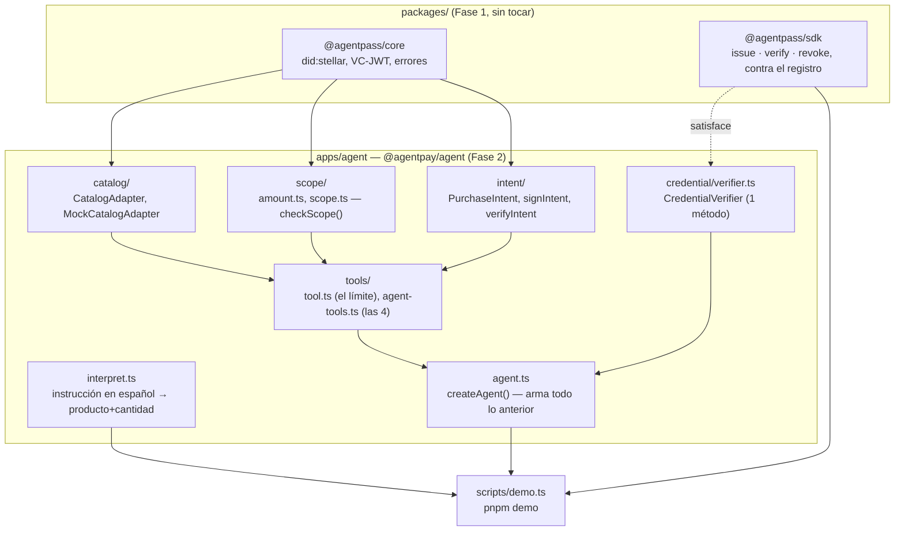

# Arquitectura técnica — Agente mínimo de compra (Fase 2)

> Referencia técnica autocontenida, en el mismo espíritu que
> [../fase-1-agentpass/ARQUITECTURA.md](../fase-1-agentpass/ARQUITECTURA.md):
> pensada para copiarse o citarse entera en un chat nuevo y que quien la lea
> entienda el sistema sin tener que leer el código fuente primero.
>
> El porqué de cada decisión está en [DECISIONES.md](DECISIONES.md) (prefijo
> `B-`); el avance hito a hito, con evidencia cruda, en
> [BITACORA.md](BITACORA.md) y [evidencia/](evidencia/). Este archivo es el
> mapa técnico denso; los otros son la narrativa.

Última revisión: 2026-09-02 · Estado: T9–T14 completos · T15 bloqueado por el
embajador (ver §8)

---

## 1. Vista de conjunto



`apps/agent` depende de `@agentpass/core` y `@agentpass/sdk` (Fase 1), nunca al
revés — ninguno de los dos conoce la existencia del agente. El único punto de
contacto con la red viva es `CredentialVerifier`, satisfecho por `AgentPass`
del SDK sin adaptador (ver §4). El catálogo, el chequeo de alcance y la firma
del intent son puros — sin red, sin reloj salvo el que se inyecta.

## 2. Estructura del paquete

```
apps/agent/
├── src/
│   ├── catalog/
│   │   ├── ids.ts        # VenueId, AssetId — forma canónica, comparación byte a byte
│   │   ├── catalog.ts     # CatalogAdapter, Product, parseProduct (el único borde de validación)
│   │   ├── mock.ts        # MockCatalogAdapter, 12 productos, 2 con prompt injection
│   │   └── *.test.ts
│   ├── credential/
│   │   └── verifier.ts    # CredentialVerifier (1 método), checkOwnCredential(), CredentialState
│   ├── scope/
│   │   ├── amount.ts       # aritmética exacta, enteros escalados a 7 decimales
│   │   └── scope.ts        # checkScope() — venue, asset, moneda, monto. Nunca recibe un Product.
│   ├── intent/
│   │   ├── intent.ts       # PurchaseIntent — el esquema zod completo
│   │   └── sign.ts         # signIntent(), verifyIntent() — VC-JWT reaplicado, firma del agente
│   ├── tools/
│   │   ├── tool.ts         # TOOL_NAMES, createToolSet() — la lista ES el límite de autorización
│   │   └── agent-tools.ts  # las 4 herramientas reales
│   ├── interpret.ts        # interpretPurchase() — determinístico, nunca produce venue/asset/monto
│   ├── agent.ts            # createAgent() — orquesta todo lo anterior
│   ├── testing/
│   │   └── credentials.ts  # makeTestCredential(), createStubVerifier() — firma real, red simulada
│   └── index.ts             # superficie pública completa del paquete
├── package.json             # nombre: @agentpay/agent (no @agentpass/*, ver B-2)
└── README.md
```

`@agentpay/agent`, no `@agentpass/agent`: el agente **consume** AgentPass, no
lo extiende (`B-2`). Cuando la Fase 3 agregue PolicyRail y Mandato, es
razonable que también vivan bajo el scope `@agentpay/*` en vez de `@agentpass/*`
— son consumidores de la identidad de la Fase 1, igual que este paquete.

## 3. El catálogo

```ts
interface CatalogAdapter {
  readonly venueId: VenueId;
  listProducts(): Promise<readonly Product[]>;
  getProduct(id: string): Promise<Product>;   // throws ProductNotFound
}
```

`MockCatalogAdapter` es la única implementación hoy. `BazaarSorobanAdapter`
(T15) implementará la misma interfaz — bloqueado por el embajador, no por
diseño.

**Identificadores canónicos** (`B-3`), comparados siempre byte a byte, sin
`trim` ni plegado de mayúsculas:

| | forma | ejemplo |
|---|---|---|
| `VenueId` | `<slug>:<contract id>` | `mock-bazaar:CCL57L4Z…I3TM7F` |
| `AssetId` | `<CODE>:<issuer>` | `USDC:GBBD47IF…FLA5` |

**`parseProduct` es el único borde de validación** (`B-5`): todo adaptador
pasa cada fila cruda por ahí. `name` y `description` son texto de un tercero,
validado solo por forma (longitud, sin caracteres de control) — nunca por
significado. Dos de los doce productos del mock llevan prompt injection real
en su descripción, en el catálogo por defecto, no en un fixture (`B-4`).

## 4. Verificación de la credencial — dos capas, momentos distintos

```ts
interface CredentialVerifier {
  verify(jws: string, options?: { now?: Date }): Promise<VerifiedOwnCredential>;
}
```

Un puerto de **un solo método** (`B-9`). `AgentPass` de `@agentpass/sdk` lo
satisface estructuralmente, sin adaptador — comprobado en tiempo de compilación
en el test suite. El agente no tiene acceso a `issue()`, `revoke()` ni
`registerIssuer()`: no puede emitirse una credencial a sí mismo porque esas
funciones no son alcanzables, no porque no se llamen.

| capa | qué decide | cuándo | resuelve |
|---|---|---|---|
| `checkOwnCredential()` al arrancar | qué herramientas **existen** | una vez, en `createAgent()` | `B-6`, `B-10` (T11) |
| reverificación dentro de `create_purchase_intent` | si la autoridad sigue **viva** | en cada intento de firmar | `B-17` (T13) |

Un fallo en cualquiera de las dos —revocada, vencida, nunca anclada, emisor
desactivado, o un error de red— resuelve a **fail-closed** (`B-12`), en la
misma dirección que `B-1`.

## 5. Las cuatro herramientas — la lista es el límite

```ts
const TOOL_NAMES = ["list_products", "get_product", "check_my_credential", "create_purchase_intent"] as const;
```

Unión de literales: una quinta herramienta no compila (`B-7`). `createToolSet()`
recibe exactamente los tools que el llamador decide incluir; invocar un nombre
ausente falla con `UnknownTool`, no con un permiso denegado (`B-6`) — la
diferencia es deliberada: un permiso denegado vive dentro del contexto del
modelo y es negociable; una herramienta ausente no tiene con qué negociarse.

`create_purchase_intent` solo se construye si `deps.credential.usable &&
deps.signer !== undefined` — ver `agent.ts`. Sin llave de firma, la
herramienta se retira en silencio (capacidad no ejercible → no anunciada);
con una llave que no es el sujeto de la credencial, `createAgent()` falla
ruidosamente con `SignerMismatch` (mala configuración, no estado de política
— `B-18`).

## 6. El chequeo de alcance — `checkScope()`

```ts
interface ScopeRequest {
  readonly venue: string;
  readonly asset: string;
  readonly unitAmount: string;
  readonly quantity: number;
}
function checkScope(scope: Scope, request: ScopeRequest): ScopeDecision;
```

**Nunca recibe un `Product`** (`B-13`) — es la defensa estructural contra
prompt injection de la fase, probada en las dos direcciones en
`injection.test.ts`. Cinco chequeos, en orden (el primero que falla es el que
se reporta):

1. `intent:create` ∈ `scope.actions` (`B-16`)
2. venue ∈ `scope.venues`, fail-closed si la lista está vacía (`B-1`)
3. asset ∈ `scope.assets`, mismo criterio
4. `scope.limits.currency` coincide con el código del asset del precio (`B-15`)
5. `unitAmount × quantity ≤ scope.limits.perTx`, en aritmética exacta —
   enteros escalados a 7 decimales, nunca `Number` (`B-14`); borde inclusivo,
   igual que `expires_at` en el contrato de la Fase 1

**`scope.limits.perDay` no se aplica, a propósito** (`B-16`): un total diario
exige memoria de gastos pasados, que es *enforcement* con estado — el trabajo
que le corresponde a **PolicyRail en esta fase que empieza**. Hay un test que
fija esa frontera exacta.

## 7. El `PurchaseIntent` firmado — la pieza central para la Fase 3

```ts
interface PurchaseIntent {
  type: ["AgentPayIntent", "PurchaseIntent"];
  intentId: string;              // uuid
  issuedAt: string;               // ISO 8601
  expiresAt: string;               // ISO 8601 — 15 min por defecto (B-20)
  agent: string;                   // did:stellar del agente — firma este documento
  principal: string;               // did:stellar de quien el agente representa
  credential: { hash: string; registry: string };  // trazable a la credencial que autorizó
  venue: string;                    // VenueId
  purchase: {
    productId: string;
    quantity: number;
    unitAmount: string;             // decimal, string
    totalAmount: string;             // exacto, calculado en scope/amount.ts
    asset: string;                    // AssetId
  };
  authorisation: { perTx: string; currency: string };  // el límite contra el que se comparó
}
```

Firmado por el **agente** (no por el emisor de la credencial) — misma
maquinaria VC-JWT de la Fase 1: JWS compacto EdDSA, `kid` nunca elige la llave
de verificación, firma antes que ventana temporal (`B-18`).
`verifyIntent(jws)` verifica firma y ventana **offline**; no consulta al
registro por el hash de la credencial — decidir en qué registro confiar es del
llamador, la misma regla de `RegistryMismatch` de la Fase 1.

**Deliberadamente no lleva** nombre ni descripción del producto (`B-19`): es
texto de un tercero, y un documento firmado no debe cargar la firma del agente
sobre la prosa de otro. `productId` es lo único que el comercio puede
respaldar.

**Por qué esta forma importa para la Fase 3 en particular:** el Mandato de la
Fase 3 es, en la práctica, la otra mitad de esta conversación —el
consentimiento firmado del principal— y comparar un intent contra un mandato
necesita exactamente estos ocho datos: quién, para quién, dónde, qué, cuánto,
en qué activo, bajo qué límite, hasta cuándo. Los ocho ya están. La forma de
`PurchaseIntent` **no debería tener que cambiar** para que Mandato la
consuma — si al diseñar Fase 3 parece que sí hace falta, es señal de pararse a
revisar, no de romperlo en silencio.

## 8. Bloqueante compartido: la pregunta 6 del embajador

T15 (el bazaar real) está bloqueado por diez preguntas ya enviadas al
embajador. La Fase 3 comparte el bloqueo de **una** de ellas, la que más pesa:

> ¿El comprador puede ser una cuenta de contrato (`C...`), o solo una cuenta
> clásica (`G...`)?

Determina si PolicyRail puede vivir **on-chain**, como *smart account* que
hace cumplir el límite en la misma transacción de compra, o si tiene que vivir
como **middleware off-chain** que autoriza antes de que la transacción se
firme — dos arquitecturas distintas, no una variación de la misma. Por eso
`ROADMAP.md §4.3` todavía no tiene desglose de tareas: diseñarlo en detalle
antes de esa respuesta repetiría el error que la Fase 0 evitó a propósito
—construir contra un caso de uso imaginario— esta vez en la pieza de mayor
riesgo arquitectónico del proyecto completo.

## 9. Manejo de errores

Todos los códigos que la Fase 2 agregó a la misma unión de
`packages/core/src/errors.ts` — ninguna jerarquía paralela:

```
InvalidVenueId · InvalidAssetId · InvalidProduct · ProductNotFound
UnknownTool · InvalidToolInput
InvalidAmount
ScopeActionNotAllowed · ScopeVenueNotAllowed · ScopeAssetNotAllowed
ScopeCurrencyMismatch · ScopeAmountExceeded
InvalidIntent · IntentExpired · IntentNotYetValid · SignerMismatch
InstructionNotUnderstood
```

## 10. Testing

| suite | cobertura | toca red |
|---|---|---|
| `apps/agent` (252 tests) | catálogo, herramientas, credencial, scope, intent, intérprete, inyección | no |
| `scripts/lib` (32 tests, incluye `demo-args.test.ts`) | helpers de scripts, parsing de argumentos de `pnpm demo` | no |
| `packages/*` (100 tests) | sin cambios desde la Fase 1 | no / 3 sí (integración) |
| `pnpm demo` | el recorrido completo, real | **sí** — anclaje y revocación reales |

**384 tests rápidos en total.** Práctica seguida en cada hito: mutation
testing deliberado — romper una protección a propósito y confirmar que los
tests correctos se ponen en rojo. Pasó cinco veces en esta fase que una
mutación **mal escrita** (una que no cambiaba el comportamiento real) reveló
un hueco de cobertura más valioso que una mutación bien escrita que
simplemente confirmaba lo esperado — vale tenerlo presente al diseñar los
tests de PolicyRail/Mandato: una mutación que sobrevive merece analizarse
antes de descartarse.

## 11. La demo

`pnpm demo` (`scripts/demo.ts` + `scripts/lib/demo-args.ts`), ~12 segundos
contra testnet real: instrucción en español (offline, primero) → credencial
emitida y anclada → agente arranca → intent firmado → revocación real →
reintento rechazado. `--adapter=bazaar` es el seam reservado para T15, hoy
falla con `NotImplemented` sin tocar la red.

## 12. Fuera de alcance de la Fase 2, a propósito

`scope.limits.perDay` sin aplicar (`B-16`, es trabajo de PolicyRail) ·
PolicyRail · Mandato · MandateGate · MandateVault · cualquier interfaz web ·
Stellar mainnet · rieles fiat o PSP · verificación continua de la credencial
fuera del instante de firmar (`B-23`, `check_my_credential` reporta un
snapshot del arranque, no en vivo).

`CLAUDE.md` en la raíz todavía lista `PolicyRail, Mandato, MandateGate,
MandateVault` como fuera de alcance — esa línea se escribió para la Fase 1 y
sigue vigente hasta que la Fase 3 la reemplace explícitamente por su propio
alcance (PolicyRail y Mandato entran; MandateGate y MandateVault siguen
afuera).
