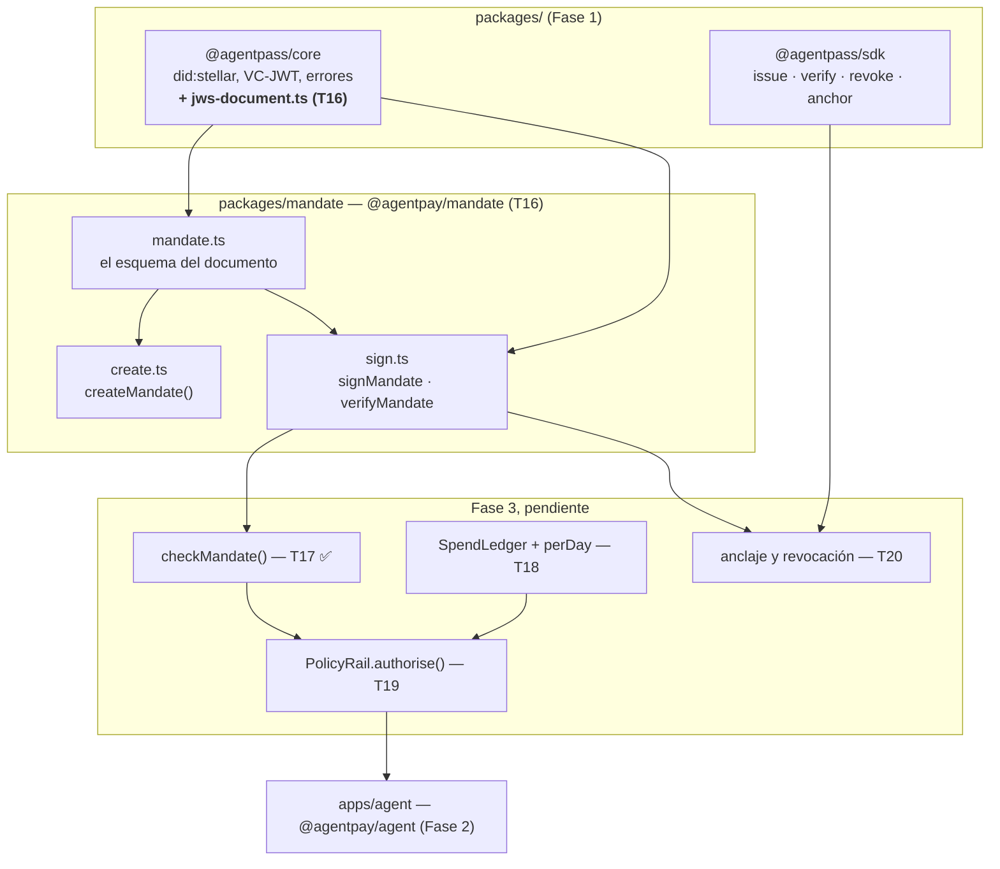

# Arquitectura técnica — PolicyRail + Mandato (Fase 3)

> Mapa técnico denso y autocontenido de la Fase 3: para darle contexto a un chat
> nuevo sin que tenga que leer el código.
>
> Qué prueba la fase: [CONTEXTO.md](CONTEXTO.md) ·
> Estado hito a hito: [BITACORA.md](BITACORA.md) ·
> Decisiones con su motivo: [DECISIONES.md](DECISIONES.md) ·
> Lo que la Fase 2 deja: [../fase-2-agente-compra/ARQUITECTURA.md](../fase-2-agente-compra/ARQUITECTURA.md)

**Estado:** T17 cerrado. Las secciones marcadas *(pendiente)* describen el
diseño acordado, no código que exista.

---

## 1. Vista de conjunto



`@agentpay/mandate` depende de `@agentpass/core` y de nada más del repo. Ni
`core`, ni `sdk`, ni el agente saben que existe.

## 2. Los tres documentos firmados del proyecto

| | credencial | intent | **mandato** |
|---|---|---|---|
| fase | 1 | 2 | **3** |
| firma | el emisor | el agente | **el principal** |
| `typ` | `vc+jwt` | `intent+jwt` | **`mandate+jwt`** |
| ventana | `validFrom`/`validUntil` | `issuedAt`/`expiresAt` | `validFrom`/`validUntil` |
| códigos | `CredentialExpired`… | `IntentExpired`… | `MandateExpired`, `MandateNotYetValid` |
| anclado | sí | no | **sí** (`M-3`) |

Los tres `typ` son distintos y cada verificador rechaza los otros dos: un
documento de un tipo no puede pasar por otro. Hay un test por cada dirección.

## 3. `jws-document.ts` — la maquinaria, una sola vez

`packages/core/src/jws-document.ts` (T16, `M-5`). Firma y verifica **cualquier**
documento estructurado como JWS compacto con una llave `did:stellar`,
parametrizado por un perfil:

```ts
interface JwsDocumentProfile<T> {
  readonly typ: string;                          // "mandate+jwt"
  readonly schema: z.ZodType<T>;                  // el esquema completo
  readonly signerField: string;                    // para espiar antes de la firma
  readonly signerDid: (document: T) => StellarDid;  // el mismo campo, ya tipado
  readonly invalidCode: AgentPassErrorCode;
}
```

Las dos reglas de la Fase 1 quedan dentro y no son opcionales:

1. **`kid` nunca elige la llave de verificación.** Sale siempre de un campo del
   payload; `kid` solo se contrasta.
2. **La firma se verifica antes que cualquier cosa sobre el contenido.** El
   esquema completo corre solo sobre bytes que el firmante firmó.

Y una tercera, propia de la versión genérica: `signerField` y `signerDid` nombran
el mismo campo dos veces —uno para espiar el payload sin validar, el otro para
leerlo ya tipado— así que se **cruzan** después de verificar. Un perfil cuyos dos
campos no coincidan verificaría contra una llave y reportaría otra; hay un test
que lo prueba con un perfil deliberadamente inconsistente.

**No chequea ninguna ventana temporal**, a propósito: cada documento nombra la
suya con campos distintos y la reporta con códigos distintos. El llamador la
chequea sobre lo que esta función devuelve, que ya es el orden correcto.

`vc-jwt.ts` y el firmado de intents **no** se reescribieron para usar esto —
ver `M-5`.

## 4. La forma del Mandato

```ts
interface AgentPayMandate {
  "@context": ["https://www.w3.org/ns/credentials/v2"];
  type: ["VerifiableCredential", "AgentPayMandate"];
  mandateId: string;        // uuid — ver M-6
  issuer: string;            // did:stellar del PRINCIPAL. Firma este documento.
  validFrom: string;          // ISO 8601
  validUntil: string;          // ISO 8601 — obligatorio, ver M-7
  credentialSubject: {
    id: string;                // did:stellar del agente que este mandato habilita
    grant: Scope;               // EL MISMO Scope de la credencial — ver M-4
  };
  credentialStatus: { type: "AgentPassRegistry2026"; registry: string };
}
```

Tres cosas que no son obvias:

**El `issuer` *es* el principal.** No hay un campo `principal` aparte que lo
duplique: dos campos que siempre tienen que coincidir son un bug esperando el
único camino de código que se olvide de cruzarlos.

**`grant` es `scopeSchema` reusado tal cual**, no una copia con la misma forma.
`M-4` depende de eso: la intersección entre lo que el emisor firmó y lo que el
principal consintió solo es significativa —y solo es type-safe— si las dos cosas
son la misma estructura.

**Se conserva el sobre W3C VC 2.0 y el nombre `credentialStatus`**, aunque suene
raro en un mandato. No es imitación: es lo que hace que `anchor(issuer, hash,
subject, expires_at)` mapee sin sobrar nada (`M-3`).

## 5. Firmar y verificar un Mandato

```ts
createMandate(request, { now? }): AgentPayMandate       // arma, no firma
signMandate(mandate, keypair): Promise<SignedMandate>   // el principal firma
verifyMandate(jws, { now? }): Promise<VerifiedMandate>  // offline, siempre
```

`signMandate` falla con **`SignerMismatch`** si la llave no es el `issuer` del
documento. El caso que más importa de esa protección: **un agente no puede
firmar su propio mandato.** Tiene su propio test, nombrado así.

`verifyMandate` chequea, en este orden: header (`alg`, `typ`) → espía el
`issuer` → cruza el `kid` → **firma** → esquema completo → cruce del signer →
**ventana**. La ventana al final, por la misma razón de la Fase 1: un mandato
falsificado *y* vencido tiene que reportar la falsificación, no la expiración.

Bordes **inclusivos** en los dos extremos, igual que `validUntil` en la Fase 1 y
`expires_at` en el contrato — para que los tres nunca discrepen sobre cuál es el
último instante válido.

Lo que `verifyMandate` **no** hace: consultar el registro (necesita red, y en
qué registro confiar es del llamador — misma regla de `RegistryMismatch`), ni
comparar el mandato contra ningún intent (eso es `checkMandate`, T17, y
separarlo es lo que la deja ser una función pura).

## 6. `checkMandate()` — T17 ✅

Vive en `apps/agent/src/mandate/check-mandate.ts` — no en `@agentpay/mandate`,
a propósito: es un consumidor de dos documentos (`AgentPayMandate` del paquete
de mandato, `PurchaseIntent` del propio `apps/agent`), y el mismo lugar donde
ya vive `checkScope()`.

```ts
function checkMandate(mandate: AgentPayMandate, intent: PurchaseIntent): MandateDecision;
```

**Nunca recibe un `Product` ni texto de un tercero** — `B-13` aplicado a esta
fase, y automático: `PurchaseIntent` no tiene ningún campo donde la prosa de un
comercio pudiera viajar (`B-19`). Fail-closed en todo (`B-1`), aritmética en
enteros escalados a 7 decimales (`B-14`), nunca `Number`.

Ocho chequeos, broadest-first, igual que `checkScope()`:

1. `mandate.credentialSubject.id === intent.agent` — **`MandateAgentMismatch`**
2. `mandate.issuer === intent.principal` — **`MandatePrincipalMismatch`**
3. `intent:create ∈ grant.actions` — **`MandateActionNotAllowed`**
4. `intent.venue ∈ grant.venues`, fail-closed si vacía — **`MandateVenueNotAllowed`**
5. `intent.purchase.asset ∈ grant.assets` — **`MandateAssetNotAllowed`**
6. `grant.limits.currency` coincide con el código del asset — **`MandateCurrencyMismatch`**
7. `intent.issuedAt ∈ [mandate.validFrom, mandate.validUntil]`, bordes inclusivos — **`MandateWindowMismatch`** (`M-8`, nuevo: no tiene equivalente en `checkScope()`, porque el mandato es el primer documento de la fase con ventana propia contra la que comparar otro documento)
8. `unitAmount × quantity ≤ grant.limits.perTx`, aritmética exacta — **`MandateAmountExceeded`**

Los ocho datos del `PurchaseIntent` (§7 de la arquitectura de la Fase 2) alcanzan
para la comparación completa: agente, principal, venue, producto/cantidad/monto,
asset, límite y ventana. **La forma del `PurchaseIntent` no cambió.**

Los ocho códigos son propios de la fase, distintos de los `Scope*` de la Fase 2
aunque `grant` y `scope` compartan forma (`M-9`): permite saber, sin ambigüedad,
cuál de las dos autoridades rechazó una compra.

## 7. `perDay` y el estado — T18 *(pendiente)*

`B-16` dejó `scope.limits.perDay` sin aplicar y dijo por qué: un total diario
necesita memoria de gastos pasados, que es *enforcement con estado*. Es el
trabajo de este hito. Puerto `SpendLedger`, implementación en memoria primero,
corte de día en UTC, idempotente por `intentId` — dos veces el mismo intent no
puede gastar dos veces del presupuesto.

## 8. PolicyRail — T19 *(pendiente)*, y la pregunta 6

```ts
interface PolicyRail {
  authorise(intent: PurchaseIntent): Promise<Authorisation>;
}
```

`LocalPolicyRail` compone T17 + T18 off-chain y **funciona en los dos escenarios
de la pregunta 6**. El smart account on-chain (`__check_auth` que hace cumplir
el límite dentro de la misma transacción de compra) depende del supuesto `M-1`,
va aislado detrás de este mismo puerto, y es el último hito de la fase — el
único que se pierde si el supuesto resulta falso.

## 9. Manejo de errores

Códigos que la Fase 3 agregó a la misma unión de `packages/core/src/errors.ts`
— ninguna jerarquía paralela:

```
InvalidMandate · MandateExpired · MandateNotYetValid
```

`SignerMismatch` se reutiliza tal cual de la Fase 2: es exactamente el mismo
significado (la llave no es la que el documento nombra), y darle un código
propio al mandato habría partido un concepto en dos.

## 10. Testing

| suite | tests | toca red |
|---|---|---|
| `packages/core` | 74 (60 de la Fase 1 + **14 de `jws-document`**) | no |
| `packages/mandate` | 27 | no |
| `packages/sdk` | 16 | no / 3 sí (integración) |
| `packages/cli` | 29 | no |
| `apps/agent` | **282** (30 de `checkMandate`) | no |
| `scripts/` | 32 | no |

**455 tests rápidos, 0 fallando** (425 antes de T17). Los 5 tests que `sdk`
sumó frente a T16 no son de esta fase — ver la nota en `BITACORA.md`.

Mutation testing deliberado en cada punto crítico, con las salidas en
[evidencia/](evidencia/). En T16 pasó de nuevo lo que la Fase 2 anotó: la
mutación que **sobrevivió** (`M1`, "`kid` elige la llave") valió más que las que
cayeron — resultó ser equivalente, porque otra protección la tapaba, y al
analizarla apareció el test que faltaba de verdad.

## 11. Fuera de alcance de la Fase 3, a propósito

MandateGate (Fase 4) · MandateVault (Fase 5) · cualquier UI web · Stellar
mainnet · rieles fiat o PSP · movimiento real de fondos · unificar las tres
implementaciones de firma JWS (`M-5`, propuesta pendiente, **no** ejecutada).
