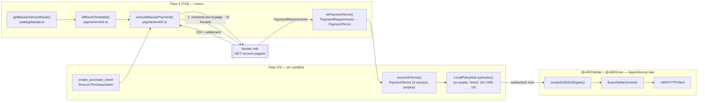

# Arquitectura técnica — MandateGate (Fase 4)

> Mapa técnico denso y autocontenido de la Fase 4: para darle contexto a un
> chat nuevo sin que tenga que leer el código.
>
> Qué prueba la fase: [CONTEXTO.md](CONTEXTO.md) ·
> Estado hito a hito: [BITACORA.md](BITACORA.md) ·
> Decisiones con su motivo: [DECISIONES.md](DECISIONES.md) ·
> Lo que la Fase 3 deja: [../fase-3-policyrail-mandato/ARQUITECTURA.md](../fase-3-policyrail-mandato/ARQUITECTURA.md)

**Estado:** T24 cerrado.

---

## 1. Vista de conjunto



`LocalPolicyRail`, `reconcileTerms`, `SpendLedger`, `checkScope`,
`checkMandate` — **cero cambios**. `authorise()` ya tenía un parámetro
`terms?: PaymentTerms` desde T19; hasta T24 nunca se le pasaba nada distinto
de `undefined`, porque no existía ningún reto `402` real contra el cual
reconciliar. Todo lo nuevo de esta fase converge hacia ese parámetro que ya
existía — no hay una segunda vía de autorización.

## 2. El módulo nuevo: `apps/agent/src/payment/x402.ts`

| Función | Qué hace | Pura / red |
|---|---|---|
| `toPaymentTerms(requirements, venueId)` | Mapea `PaymentRequirements` de x402 (asset = dirección de contrato completa, amount = entero escalado) a `PaymentTerms` (3 campos, nuestro formato) | Pura |
| `fillRouteTemplate(baseUrl, route, params)` | Rellena los `{placeholder}` de un `routeTemplate` de `ServiceCard` | Pura |
| `executeBazaarPayment(deps, input)` | Orquesta: `fetch` → espera `402` → `toPaymentTerms` → `PolicyRail.authorise()` → si autoriza, firma y envía con `@x402/stellar` → reintenta → devuelve el recibo | Red |

`executeBazaarPayment` nunca firma nada antes de que `PolicyRail.authorise()`
devuelva `authorised: true` — verificado con un test que cuenta las llamadas
a `fetch` (una sola, la del reto, si el rail rechaza) y con un test que
inspecciona los argumentos exactos que le llegan a `authorise()`.

## 3. Identidades resueltas contra tráfico real, no supuestas

| Campo del reto `402` real | Valor observado (T24, contra `stellar-bazaar-x402.vercel.app`) |
|---|---|
| `scheme` | `"exact"` |
| `network` | `"stellar:testnet"` |
| `payTo` | `GDVR2KDK5DSMNYZJKNISUIOBDC6FZK3XZOIQWSS7KL4BRMD5BMW6RMCQ` (cuenta clásica del bazaar) |
| `asset` | `CBIELTK6YBZJU5UP2WWQEUCYKLPU6AUNZ2BQ4WWFEIE3USCIHMXQDAMA` — la dirección **completa** del contrato SAC, no el código `"USDC"` que trae el `ServiceCard` de discovery |
| `amount` | `"10000"` — entero escalado a 7 decimales (10000 / 10⁷ = 0.0010000) |

**Hallazgo de T24, verificado con `Asset.contractId()` del propio
`@stellar/stellar-sdk` ya instalado:** ese contrato SAC es el wrapper
determinístico exacto de `USDC:GBBD47IF6LWK7P7MDEVSCWR7DPUWV3NY3DTQEVFL4NAT4AQH3ZLLFLA5`
— el mismo emisor clásico que `USDC_TESTNET` en `mock.ts` ya usa. Mismo USDC
de testnet, dos direcciones distintas del mismo activo. `B-24` (T15) ya había
anotado esto como "probablemente el mismo activo"; T24 lo confirma con
matemática, no con intuición. `mapAssetContract()` (`catalog/bazaar.ts`)
resuelve `CBIELTK6...` → `BAZAAR_USDC` (`USDC:CBIELTK6...`, la forma que
`ids.ts` exige para un emisor-contrato).

## 4. El pagador: cuenta clásica, no `policy_rail`

`ExactStellarScheme` (de `@x402/stellar`) recibe un `ClientStellarSigner` —
una interfaz duck-typed (`{ address, signAuthEntry, signTransaction? }`), no
una instancia de `Keypair`. `createEd25519Signer(secret, network)` construye
ese signer directo desde la llave secreta cruda del agente
(`AGENT_SECRET_KEY`), sin pasar por el `Keypair` de este repo — evita
cualquier problema de `instanceof` entre las dos copias de
`@stellar/stellar-sdk` instaladas (este repo usa `^17.0.1`; `@x402/stellar`
depende de `^16.0.1`).

`policy_rail` (T22, el smart account con `perTx`/`perDay` on-chain) **no se
usa**. Sigue siendo una segunda implementación posible del mismo puerto
(`PolicyRail`), medida y viable (`M-12`, `M-21`, `M-22`), no elegida para
esta demo. Ver `DECISIONES.md` → `G-1`.

## 5. Dependencias nuevas

```
apps/agent/package.json
  + @x402/stellar@^2.24.0   (ExactStellarScheme, createEd25519Signer, STELLAR_TESTNET_CAIP2)
  + @x402/core@~2.24.0      (x402Client, x402HTTPClient — dependencia directa,
                              necesaria para que TypeScript resuelva sus subpaths
                              @x402/core/client y @x402/core/types; @x402/stellar
                              la trae transitiva pero eso no basta para node_modules
                              estricto de pnpm)
```

Ambos paquetes son públicos, Apache-2.0, npm — mismos que `T22-spike.md` ya
había leído (versión 2.24.0, sin cambios relevantes desde entonces). El punto
de entrada público real (`x402Client`, `x402HTTPClient`,
`ExactStellarScheme`, `createEd25519Signer`) se leyó del paquete instalado
(`node_modules/.pnpm/@x402+*/**/*.d.mts`) antes de escribir código — misma
disciplina que T19/T22/T15, no asumida desde el spike anterior (que solo
había leído *internals*, no la superficie pública que un consumidor real
usa).

## 6. Scripts nuevos

| Script | Qué hace |
|---|---|
| `pnpm run fund:usdc` | Abre el trustline de USDC en la cuenta del agente (`scripts/fund-usdc-trustline.ts`). No fondea el saldo — eso es un faucet de un tercero (Circle), fuera del control de este repo. |
| `pnpm run demo:pay-real` | La prueba de punta a punta de T24 (`scripts/demo-real-payment.ts`): emite credencial + mandato, firma un intent, ejecuta el pago real contra `swap-risk-quote`, imprime el recibo con el hash de transacción real. Deliberadamente separado de `pnpm demo` — ver `DECISIONES.md` → `G-6`. |

`scripts/lib/network.ts` ganó `getTrustline()` y `openTrustline()` — la
primera vez que este repo construye y envía una transacción **clásica**
(`change_trust`), no una invocación Soroban. Mismo estilo que el resto del
archivo: `AgentPassError` `NetworkError` en cada punto de fallo, sin excepción
nativa escapando sin envolver.

## 7. Lo que sigue fuera, a propósito

Ver `CONTEXTO.md` §4 y §6. En particular: convertir `executeBazaarPayment` en
una quinta `tool` del agente (`TOOL_NAMES`) es una decisión de seguridad
aparte, no tomada — hoy solo es invocable desde un script/servidor de
confianza, nunca desde la instrucción en español que interpreta el agente.
