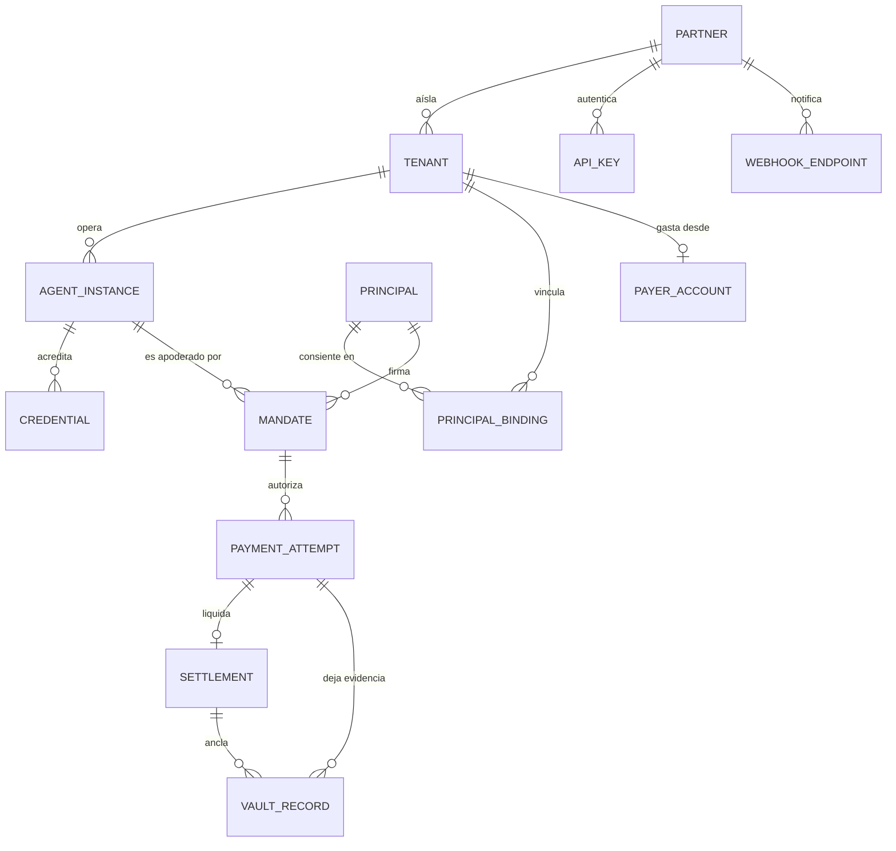

# Plataforma para partners — diseño, sin implementar

> **Estado: propuesta. Nada de este documento está construido.**
> Fecha: 2026-09-10 · Autor: Claude Code · Rama: `cc/diseno-plataforma-partners`
>
> Este documento **no** modifica ninguna decisión vigente, ningún contrato,
> ni `checkMandate`, `scope.limits`/`perDay`, MandateVault o la integración
> del bazaar. Es material para revisar y aprobar antes de que exista una
> línea de código.
>
> Contexto: [CONTEXTO.md](CONTEXTO.md) · Bitácora: [BITACORA.md](BITACORA.md) ·
> Decisiones de la fase: [DECISIONES.md](DECISIONES.md) ·
> Decisión de arranque: [../DECISIONES.md § P-6](../DECISIONES.md)

**Convención de este documento.** Cada afirmación sobre capacidades lleva
una de tres etiquetas, sin excepción:

| Etiqueta | Significa |
|---|---|
| `YA` | Implementado y verificado en el repo hoy, con archivo y línea |
| `PROP` | Propuesto en este documento, no existe |
| `DEC` | Requiere una decisión tuya antes de poder proponerse siquiera |

---

## 1. Resumen ejecutivo

**Qué hay hoy, verificado leyendo el código y no la documentación.** AgentPey
prueba, de punta a punta y contra Stellar testnet real, la cadena completa
de un pago agéntico: una wallet real (Freighter) demuestra que controla su
dirección con una firma SEP-0053; esa misma wallet firma su propio Mandato y
lo ancla on-chain; un agente con credencial AgentPass verificable pide una
factura x402 a un comercio real; el gasto pasa por dos autoridades
independientes (`checkScope` sobre la credencial, `checkMandate` sobre el
Mandato) más un límite diario; el pago lo liquida un smart account
`policy_rail` que vuelve a aplicar `perTx`/`perDay` dentro de la misma
transacción; y todo queda en una bitácora encadenada por hash en Postgres.
Eso funciona, está testeado (734 tests) y fue confirmado en el deploy real.

**Qué no hay, y es lo que separa el piloto de una plataforma.** Todo lo
anterior corre sobre **una sola identidad Stellar compartida**. Los dos
secretos que firman (`AGENT_SECRET_KEY`, `ISSUER_SECRET_KEY`) y el único
contrato `policy_rail` desplegado son los mismos para todos los visitantes
(`render.yaml`, `apps/web/src/server.ts:startSession`). No existe la noción
de partner: no hay tabla de partners, ni API key, ni scopes, ni idempotencia,
ni versionado, ni rate limiting, ni webhooks, ni OpenAPI — verificado con
una búsqueda sobre todo el repo, cero coincidencias. El paquete que resuelve
la derivación de llaves por tenant, `@agentpey/tenancy` (T32), **no está
importado por ningún archivo fuera de su propio paquete**: existe como
biblioteca, no como capacidad del producto. Y el `tenant_id` de hoy es
`sha256(dirección de la wallet)` (`apps/web/src/wallet-session.ts:walletTenantId`),
lo que significa que la misma wallet usada con dos partners distintos cae en
**el mismo tenant** — exactamente el modelo que el objetivo B2B2C prohíbe.

**Tres hallazgos que no estaban anotados en la documentación de la fase y
que cambian el orden del trabajo.**

1. **La sesión no es durable, el vault sí.** El Mandato y la credencial de
   cada visitante viven en un `Map` en memoria (`sessions`,
   `apps/web/src/server.ts`). Un redeploy de Render, o simplemente volver
   mañana, obliga a apretar "Iniciar sesión" otra vez, y eso **emite una
   credencial nueva y un Mandato nuevo**. El objetivo dice, literalmente,
   que renovar un mandato no debe crear un agente nuevo y que una sesión no
   debe crear identidad nueva. Hoy el sistema hace lo contrario, y no por un
   bug sino porque nunca hubo una tabla donde persistir esas entidades.
2. **El límite diario tiene un agujero de concurrencia entre procesos, no
   solo de escrituras.** `createPostgresMandateVault` carga todas las filas
   del tenant en memoria al construirse y responde `spentOn()` desde ese
   caché (`packages/vault/src/postgres-vault.ts`). Dos procesos sirviendo al
   mismo tenant ven, cada uno, un `spentToday` desactualizado, y el camino de
   cuenta clásica podría gastar por encima de `perDay`. El camino
   `policy_rail` no: ahí el límite lo aplica el contrato dentro de la
   transacción. Es decir, **la mitigación existente es el pagador on-chain**,
   y eso conviene tenerlo explícito antes de escalar a más de una instancia.
   `C-7` documenta la serialización de escrituras dentro del proceso; la
   lectura de totales no estaba anotada.
3. **Cualquier wallet conectada se registra sola como emisor usando la clave
   admin de la plataforma** (`ensureWalletIsRegisteredIssuer`,
   `apps/web/src/server.ts`; decisión `C-15`). En una demo de un visitante
   es razonable y está declarado como tal. En una plataforma con partners es
   un camino de escritura on-chain sin límite, pagado por la cuenta admin,
   accesible a cualquiera que conecte una wallet.

**La decisión de fondo que este documento no toma.** Todo lo demás —el
modelo de datos, la API, el onboarding— es trabajo acotado y de bajo riesgo.
Lo que gobierna el diseño entero es **quién firma el pago y quién tiene las
llaves** (sección 4.1). Hoy, de hecho, AgentPey custodia: la plataforma
tiene el secreto que gasta y el owner del `policy_rail`. Eso es aceptable en
testnet y está declarado, pero define el techo regulatorio del producto y no
puede resolverse "más adelante", porque cambia el modelo de entidades, el
onboarding y la superficie de API. Es la primera pregunta de la sección 7.

**Recomendación de arranque.** El primer hito implementable sin tocar
ninguna área restringida es la **capa de persistencia de partner/tenant/
agente/mandato** (sección 8): una migración, un paquete nuevo
`@agentpey/registry-datos`, y ninguna modificación a `checkMandate`, a los
contratos, al vault ni al camino de pago. Habilita todo lo demás y no
depende de la decisión de custodia.

---

## 2. Arquitectura objetivo

### 2.1 Diagrama de capas

### 2.2 Modelo de entidades

**Las distinciones que el modelo preserva, una por una.**

| Distinción pedida | Cómo la sostiene el modelo |
|---|---|
| `usr_123` es identidad de aplicación, no criptográfica | Vive solo en `TENANT.external_ref`, una cadena opaca. AgentPey nunca la interpreta ni la usa para autorizar nada |
| Tenant = partner + cliente/workspace | Clave única `(partner_id, external_ref)`. El tenant **no** se deriva de la wallet |
| Principal = quien consiente y revoca | `PRINCIPAL` es global por dirección Stellar; `PRINCIPAL_BINDING` lo ata a un tenant con su prueba de control |
| Agente técnico ≠ wallet | `AGENT_INSTANCE` tiene dirección propia, derivada, distinta de la del principal |
| Cuenta pagadora ≠ wallet principal | `PAYER_ACCOUNT` es una entidad aparte, con su propio `kind` (sección 4.1) |
| Una wallet, varios partners | Un `PRINCIPAL` con N filas en `PRINCIPAL_BINDING`, una por tenant. Tenants, agentes y mandatos separados |
| Un tenant, varios agentes | `TENANT 1—N AGENT_INSTANCE`, cada uno con su índice de derivación propio |
| Renovar un mandato no crea agente | `MANDATE.agent_id` apunta al agente existente; `MANDATE.supersedes_id` encadena la renovación |
| Una compra no crea identidad | `PAYMENT_ATTEMPT` cuelga del mandato, que cuelga del agente. Ningún camino de compra escribe en `AGENT_INSTANCE` |

### 2.3 Ciclo de vida de cada entidad

Estado actual entre corchetes. `YA` significa que la entidad existe hoy en
alguna forma, aunque no persistida.

| Entidad | Creación | Actualización | Revocación / expiración | Rotación | Eliminación |
|---|---|---|---|---|---|
| **Partner** `PROP` | Alta manual, fuera de banda (no hay self-serve en testnet) | Nombre, endpoints, límites | `suspended` corta todas sus API keys y frena pagos nuevos; no borra evidencia | — | Nunca borra: `archived`. La bitácora es la razón de ser del producto |
| **API key** `PROP` | Se genera al alta; se muestra una sola vez; se guarda solo el hash | Solo `scopes` y etiqueta | Revocación inmediata por id | Emitir la nueva, período de solapamiento, revocar la vieja | Duro, permitido: no hay evidencia atada a la key |
| **Tenant** `PROP` | El partner la crea vía API con `external_ref` opaco; recibe `tenant_index` monotónico y **nunca reusado** | Etiqueta, metadata no sensible | `suspended` (frena pagos, conserva historial) | El índice **no rota**: rotar cambiaría todas las llaves derivadas | Nunca borra. Borrado del `external_ref` a pedido, conservando el tenant |
| **Principal (wallet)** `YA` parcial | Primera prueba de control SEP-0053 (`verifyStellarMessage`, hoy en `/api/wallet/verify`) | — (una dirección es inmutable) | Desvincular de un tenant revoca sus mandatos en ese tenant | Wallet nueva = principal nuevo + mandato nuevo; el agente **no** cambia | Nunca borra |
| **Vinculación principal–tenant** `PROP` | Firma del challenge dentro del contexto de ese tenant | — | `revoked_at`; corta la capacidad de firmar mandatos nuevos ahí | — | Nunca borra |
| **Instancia de agente** `PROP` | El partner la pide para un tenant; se deriva su par de llaves (`deriveTenantKeypair`, `YA` como función) | Etiqueta, estado | `retired` — deja de poder pedir intents | Rotación de llave = índice nuevo + credencial nueva + mandato nuevo apuntando al **mismo** `agent_id` | Nunca borra |
| **Credencial** `YA` | `agentpass.issue()` + anclaje on-chain | Inmutable por definición (firmada) | `revoke()` on-chain, o `validUntil` | Reemisión con hash nuevo, ligada al mismo agente | Nunca borra |
| **Mandato** `YA` | Firmado por la wallet (SEP-0053) o la plataforma (JWS), anclado on-chain | Inmutable | `revoke` on-chain firmado por el principal, o `validUntil` | Renovación = mandato nuevo con `supersedes_id` | Nunca borra |
| **Cuenta pagadora** `YA` en forma compartida | Depende de la decisión de la sección 4.1 | Límites, según opción | Vaciado/cierre; `valid_until` en el caso `policy_rail` | **Hoy imposible en `policy_rail`: el contrato no tiene rotación de owner** (`DEC`, área restringida) | Cierre y barrido de saldo |
| **Intento de pago** `YA` sin persistir | Al recibir el 402 y autorizar | Solo transiciones de estado | — | — | Nunca borra |
| **Transacción / liquidación** `YA` | Respuesta del facilitador x402 | — | — | — | Nunca borra |
| **Registro de bitácora** `YA` | Append encadenado por hash | **Nunca** se actualiza | — | — | **Nunca** se borra: rompería la cadena |

### 2.4 Separación de datos

Tres compartimentos, con una regla por borde.

| Compartimento | Contiene | Regla |
|---|---|---|
| **Partner** | `usr_123`, email, RUT, perfil, todo lo que su producto necesite | Nunca cruza a AgentPey. El contrato de integración lo dice explícito, y la API **rechaza** `external_ref` que parezca email o RUT `PROP` |
| **Usuario** | Su clave privada, su semilla, su historial de wallet | Nunca sale de Freighter. Hoy `YA`: el servidor solo ve firmas, jamás un secreto |
| **AgentPey** | `partner_id`, `external_ref` opaco, dirección pública de la wallet, dirección del agente, parámetros del mandato, hashes, transacciones | Mínimo suficiente para autorizar y probar. Una dirección Stellar es un seudónimo público, no PII, pero **es correlacionable entre partners** — ver abajo |

**El punto incómodo, dicho de frente.** Si Vinny usa `G-VINNY` con CloudOps
y con otro partner, AgentPey puede ver que es la misma persona aunque nunca
reciba su email. La aislación de tenants impide que *los partners* se vean
entre sí, no que AgentPey correlacione. Mitigaciones posibles, ninguna
gratis: (a) declararlo en la política de privacidad y no explotarlo; (b)
guardar `sha256(partner_id || dirección)` como clave de búsqueda y la
dirección en claro solo donde la cadena la exige; (c) recomendar al usuario
una wallet por partner, lo que empeora la experiencia. `DEC`.

### 2.5 Onboarding y consentimiento

El requisito difícil no es firmar: es **volver desde otro navegador**. Hoy
la identidad de sesión es una cookie derivada de la wallet
(`walletTenantId`) y el estado vive en memoria, así que "volver" es
imposible en cualquier sentido real.

Diseño propuesto `PROP`: la cookie deja de ser la identidad y pasa a ser
solo transporte. La identidad es `(tenant, principal)` en Postgres. Volver
desde otro navegador = conectar la wallet, firmar un challenge nuevo, y el
servidor encuentra los mandatos vigentes de esa wallet en ese tenant. No se
emite nada nuevo.

Cuatro propiedades que este diseño compra y que un flujo dentro del partner
no compra: el consentimiento lo muestra AgentPey, así que el partner no
puede fabricarlo; el texto que firma la wallet es el mismo que se ancla; el
partner nunca ve la firma antes que la cadena; y la revocación tiene una
URL propia, alcanzable sin pasar por el partner — que es la mitad del
sentido de "revocable desde afuera del agente".

### 2.6 Modelo de integración: SDK, API hospedada o híbrido

| Alternativa | A favor | En contra | Veredicto |
|---|---|---|---|
| **Solo SDK** (cada partner hospeda todo) | Sin custodia, sin datos de terceros en AgentPey, sin costo de infraestructura | El consentimiento lo renderiza el partner: deja de ser prueba de nada. Cada partner necesita su Postgres, su seed, su deploy. Iterar exige que N partners actualicen | No |
| **Solo API hospedada** | Un solo lugar donde arreglar cosas, evidencia centralizada, integración en horas | El agente del partner tiene que hablar HTTP para cada paso; AgentPey se vuelve dependencia de disponibilidad | Insuficiente sola |
| **Híbrido** `PROP` **recomendado** | API hospedada para identidad, consentimiento, autorización y evidencia; SDK delgado que envuelve esa API y **además** trae local lo que ya es local y verificable (`checkScope`, `checkMandate`, verificación de credencial e intent) | Dos superficies que mantener sincronizadas | **Sí** |

**Por qué el híbrido y no otra cosa.** El proyecto ya está construido así:
`@agentpass/core`, `@agentpass/sdk`, `@agentpey/mandate` y el motor de
`apps/agent` son bibliotecas puras y verificables sin red — esa es la tesis
("verificable, no confiable"). Obligar a un partner a preguntarle a una API
si un Mandato es válido, cuando puede verificar la firma él mismo, tira esa
propiedad a la basura. Y a la inversa: el consentimiento y la bitácora sí
tienen que estar hospedados, porque su valor es justamente que no los
controla la parte interesada.

Reparto concreto propuesto: **hospedado** = alta de tenants y agentes,
consentimiento, custodia de llaves derivadas, decisión de autorización con
estado (`perDay`), bitácora, webhooks. **SDK local** = verificar credencial,
verificar Mandato, `checkScope`, `checkMandate`, armar el `PurchaseIntent`,
hablar x402. Un partner paranoico puede reverificar todo lo que AgentPey
afirma.

### 2.7 Contratos de API `PROP`

Nada de esto existe hoy: el repo no tiene una sola aparición de API key,
rate limit, webhook, idempotencia ni OpenAPI.

**Autenticación.** API key por partner, prefijo de ambiente
(`ap_test_...`), guardada como hash. En el header `Authorization: Bearer`.
Firma HMAC del cuerpo (`AgentPay-Signature`) opcional en testnet,
obligatoria antes de mainnet. Rechazo tipado con `AgentPassError` + `code`,
como todo el resto del proyecto.

**Scopes**, mínimos y separados por daño: `tenants:write`, `agents:write`,
`consent:create`, `mandates:read`, `mandates:revoke`, `payments:authorize`,
`vault:read`. Una key de solo lectura para el panel del partner nunca debe
poder gastar.

**Idempotencia.** Header `Idempotency-Key` obligatorio en todo `POST` que
mueva dinero o cree identidad. Se guarda `(partner_id, key) → respuesta`
con vencimiento de 24 h; repetir devuelve la misma respuesta, no una
segunda compra. Hoy no existe, y el `intentId` del vault cumple una función
parecida pero solo dentro del vault.

**Versionado.** Prefijo `/v1` para cambios rompientes, más un header
`AgentPey-Version: 2026-09-10` fijado por partner al alta, para cambios
aditivos. Sin versión, la versión del alta.

**Rate limiting.** Por partner y por ruta, ventana deslizante, `429` con
`Retry-After`. Los límites duros van en las rutas que tocan la cadena
(anclar, revocar, registrar emisor) porque ahí cada llamada cuesta dinero
real de la cuenta admin.

**Webhooks.** `mandate.activated`, `mandate.revoked`, `mandate.expiring`,
`payment.authorized`, `payment.refused`, `payment.settled`, `agent.retired`.
Firmados con secreto por endpoint, con timestamp y ventana de replay de
cinco minutos. Reintentos con backoff exponencial y una cola de fallidos
consultable.

**OpenAPI 3.1**, generado desde los esquemas zod que ya existen, no escrito
a mano — el criterio "todo dato que cruza un borde pasa por zod" ya deja el
esquema disponible; duplicarlo a mano garantiza que se desincronice.

### 2.8 El comercio x402

**Caso base: el comercio no integra nada.** `YA` verificado. El comercio
publica su recurso con x402 y responde `402` con sus `PaymentRequirements`.
AgentPey es, desde su punto de vista, un comprador cualquiera que paga y se
va. Todo el enforcement pasa del lado del comprador. Esto ya funciona
contra el bazaar real (`apps/agent/src/payment/x402.ts`), y es la propiedad
más valiosa del diseño: no hay que convencer a ningún comercio de nada.

**Caso opcional: el comercio quiere verificar la evidencia.** `PROP` Tres
niveles, de menos a más intrusivo:

1. **Recibo consultable.** `GET /v1/receipts/{tx_hash}` devuelve, sin
   autenticación, el hash del mandato, el hash de la credencial, el
   `intentId` y la posición en la cadena del vault. El comercio verifica
   contra la cadena por su cuenta.
2. **Encabezado de evidencia.** El comprador manda un
   `AgentPey-Evidence: <jws>` junto con el pago. El comercio, con el SDK o
   con `verifyStellarMessage` a mano, comprueba que un principal identificado
   consintió esa compra. Cero cambios en x402: es un header extra que un
   comercio que no lo entiende ignora.
3. **Verificación previa.** El comercio pregunta antes de servir. Lo
   menciono para descartarlo: agrega latencia y una dependencia de
   disponibilidad al camino crítico del comercio, a cambio de poco.

---

## 3. Flujo completo: Vinny → CloudOps → AgentPey → comercio

Cada paso marcado con lo que hoy existe y lo que falta.

| # | Paso | Hoy | Qué falta |
|---|---|---|---|
| 1 | Vinny se registra en CloudOps como `usr_123` | Fuera de alcance de AgentPey | — |
| 2 | CloudOps crea el tenant: `POST /v1/tenants` con `external_ref` opaco | `PROP` | Todo: tabla, API, autenticación |
| 3 | CloudOps crea la instancia de agente para ese tenant | `PROP` — la derivación existe (`deriveTenantKeypair`), sin usarse | Índice durable, persistencia, fondeo |
| 4 | CloudOps abre un `consent_session` y redirige a Vinny | `PROP` | Flujo hospedado, token de un solo uso, redirección |
| 5 | Vinny conecta `G-VINNY` y prueba control | `YA` — SEP-0053 verificado en servidor (`/api/wallet/verify`) | Atarlo a un tenant, no a una cookie |
| 6 | Vinny lee y firma el Mandato | `YA` — la wallet firma de verdad (T35) | Presentación por partner; texto del grant como parámetro |
| 7 | El Mandato se ancla on-chain | `YA` — `agent_registry`, firmado por la wallet | Persistir el resultado |
| 8 | CloudOps recibe la confirmación | `PROP` | Webhooks |
| 9 | El agente de CloudOps pide un recurso y recibe un `402` | `YA` contra el bazaar real | Generalizar más allá de un producto y un asset |
| 10 | AgentPey verifica identidad, mandato, destinatario, monto, vigencia, revocación y límites | `YA` — las siete, `checkScope` + `checkMandate` + `checkDailyLimit` + `reconcileTerms` + estado on-chain | Que la decisión tenga estado durable entre procesos |
| 11 | Se paga | `YA` — `policy_rail` liquida con `perTx`/`perDay` on-chain | Una cuenta pagadora por tenant, no una compartida |
| 12 | Queda evidencia encadenada | `YA` — MandateVault en Postgres | Consultable por partner y por principal, con permisos |
| 13 | Vinny ve su historial y revoca | `YA` la revocación firmada por wallet; el historial **exige una sesión viva en memoria** | Historial durable, alcanzable desde otro navegador |

---

## 4. Decisiones abiertas

> **Resueltas el 2026-09-10 (T37).** Todo lo de esta sección quedó decidido y
> registrado en [DECISIONES.md](DECISIONES.md) → `C-19` a `C-25`. Se conserva
> el análisis completo abajo, sin editar, porque es el razonamiento que
> sostiene cada decisión — y porque las alternativas descartadas importan
> tanto como la elegida. Resumen: tenant = (partner, usuario final) `C-19`;
> modelo de fondos = **opción 3**, smart account por tenant `C-20`; creación
> on-chain perezosa `C-21`; integración híbrida `C-22`. Diferidas sin
> decidir: varias wallets por usuario, y mainnet.

### 4.1 La decisión crítica: fondos y autonomía

**No decido esto. Presento las cuatro opciones que pediste, con lo que
encontré leyendo el contrato y el SDK, y una recomendación al final que
necesita tu aprobación explícita.**

Punto de partida honesto: **hoy AgentPey es custodial de facto.** La
plataforma tiene `AGENT_SECRET_KEY`, que es quien paga en el camino clásico,
y tiene el owner del único `policy_rail` desplegado. El usuario no pone
fondos: los pone el proyecto. Es coherente con un piloto de testnet y está
declarado (`C-11`, `C-16`), pero no es una posición neutral de la que
partir.

---

**Opción 1 — `G-VINNY` firma cada pago.**

- *Experiencia*: pop-up de Freighter en cada compra. El agente no puede
  actuar mientras Vinny duerme.
- *Quién firma*: Vinny, siempre.
- *Llaves*: todas de Vinny. AgentPey no tiene ninguna.
- *Límites reales*: AgentPey puede negarse a pedir la firma, pero **no puede
  impedir** que Vinny firme otra cosa. El límite es asesoría, no enforcement.
- *Riesgos*: custodia nula, recuperación = la de su wallet, fraude acotado a
  que aprobó lo que aprobó, revocación trivial (deja de firmar).
- *Regulatorio*: el más limpio posible. Sin custodia, sin intermediación de
  fondos.
- *Compatibilidad con la tesis*: **la contradice**. Es el patrón de Meta
  Muse, que `P-6` clasificó como demanda de mercado y no como competidor
  precisamente porque pide aprobación humana en cada compra. Si el producto
  hace esto, no hay agente autónomo que gobernar.

---

**Opción 2 — Vinny delega capacidad limitada a una clave o sesión.**

Acá hay un hallazgo técnico que cambia la opción: **Stellar no tiene
límites de gasto por firmante.** Los firmantes adicionales de una cuenta
clásica tienen *pesos y umbrales*, no montos. Agregar una "clave de sesión"
como firmante de `G-VINNY` le da poder sobre **todo** el saldo de esa
cuenta, no sobre una parte. Las variantes que sí acotan —una cuenta
intermedia con su propio saldo, o un smart account— son, literalmente, la
opción 3.

- *Experiencia*: firma una vez, el agente opera después. La mejor de las
  cuatro, si fuera implementable como suena.
- *Quién firma*: la clave delegada.
- *Llaves*: la delegada la tendría AgentPey o el partner.
- *Límites reales*: **ninguno a nivel de red**, salvo que se degrade a la
  opción 3. Es la trampa de esta opción.
- *Riesgos*: si la clave delegada se filtra, se pierde toda la cuenta.
- *Regulatorio*: ambiguo, y la ambigüedad es mala señal.
- *Compatibilidad*: aparenta encajar y no encaja. `PolicyRail` existe
  exactamente porque esto no se puede hacer nativo.

---

**Opción 3 — Vinny fondea un `policy_rail` (smart account) por tenant.**

- *Experiencia*: una firma para consentir, una transferencia para fondear.
  Después el agente opera solo, hasta el límite y hasta `valid_until`.
- *Quién firma*: la clave owner del rail, que hoy tendría AgentPey. El
  contrato decide si la firma cuenta.
- *Llaves*: Vinny mantiene `G-VINNY`; AgentPey tiene el owner del rail.
- *Límites reales*: **los únicos verdaderamente aplicados por la red**.
  `policy_rail.__check_auth` autoriza exactamente una llamada a `transfer`
  de su propio asset, con él mismo como `from`, y aplica `per_tx` y
  `per_day` dentro de la transacción. `YA` funcionando (T31).
- *Riesgos, y acá está lo que hay que mirar*: leyendo
  `contracts/policy-rail/src/lib.rs`, el contrato **no tiene función de
  retiro, ni de rotación de owner, ni de revocación**. Solo el owner puede
  mover fondos, y solo hacia un `transfer`. Consecuencia: si AgentPey tiene
  el owner, **Vinny no puede recuperar su propio dinero**, y si el owner se
  pierde, los fondos quedan atrapados hasta `valid_until`... y después
  también. Para un piloto de testnet con montos simbólicos es tolerable.
  Para fondos de terceros, no. Arreglarlo **toca un contrato — área
  restringida, requiere tu aprobación explícita antes de que se escriba una
  línea.**
- *Regulatorio*: intermedio. AgentPey opera una llave sobre fondos ajenos,
  aunque acotada por el contrato. Con retiro por parte del principal, se
  parece más a un no-custodial con límites; sin él, se parece a custodia.
- *Compatibilidad*: **es la tesis del proyecto, escrita en Rust.** "Dale a
  tu agente un presupuesto, no tus llaves."

---

**Opción 4 — AgentPey custodia una cuenta por tenant.**

- *Experiencia*: la más simple. Sin fondeo por parte del usuario.
- *Quién firma*: AgentPey, con la llave derivada del seed maestro (`T32`).
- *Llaves*: todas de AgentPey.
- *Límites reales*: solo los que AgentPey aplique en software. Si su código
  falla, no hay red que lo frene.
- *Riesgos*: máximos. Compromiso del seed maestro = todos los tenants a la
  vez. Recuperación depende del respaldo del seed. El fraude interno es
  posible por construcción.
- *Regulatorio*: el peor. Custodia de fondos de terceros. En Chile, es lo
  que `P-6` evita explícitamente al no formalizar la SpA todavía
  ("actividad 100% testnet, sin custodia de fondos reales de terceros"). Con
  fondos reales, cambia la categoría CMF aplicable.
- *Compatibilidad*: es lo que el producto hace **hoy** en testnet, y lo que
  su narrativa dice que no hay que hacer.

---

**Recomendación, sujeta a tu aprobación.** Opción 3 como modelo del
producto, con opción 4 explícitamente rotulada como "modo demo de testnet" y
apagable, y opción 1 disponible como modo de alta seguridad para partners
que lo pidan. La opción 2, descartada por lo que dice el protocolo de
Stellar, no por preferencia.

**Precondición no negociable de la opción 3 antes de cualquier fondo real:**
que el principal pueda retirar su saldo sin depender de AgentPey. Eso es un
cambio de contrato y **no lo propongo como trabajo hasta que lo apruebes**.

### 4.2 Decisiones abiertas menores

| # | Decisión | Opciones | Recomendación | Razón |
|---|---|---|---|---|
| D1 | Dónde vive el seed maestro | `.env.local` / gestor de secretos / KMS con derivación fuera de proceso | Gestor de secretos (Doppler o Infisical) ahora; KMS antes de mainnet | Lo que `C-3` ya anticipó. KMS antes de tiempo cuesta y no protege nada más en testnet |
| D2 | Quién emite la credencial del agente | La plataforma / el partner / el propio tenant | La plataforma, como hoy (`C-17`) | Que el partner emita significa que el partner acredita a su propio agente. Se pierde el tercero verificable |
| D3 | Alta automática de emisores on-chain | Automática como hoy (`C-15`) / por partner al alta / manual | Por partner: se registra el emisor del partner una vez, no una wallet por visitante | Hoy cualquier wallet dispara una escritura on-chain pagada por la clave admin |
| D4 | Namespace del `tenant_id` en el vault | `sha256(wallet)` como hoy / `partner_id:tenant_ulid` | `partner_id:tenant_ulid` | El actual colisiona entre partners. Migración: las filas viejas quedan bajo su id viejo, sin reescribir la cadena |
| D5 | Esta es Fase 6 o Fase 7 | Extender Fase 6 / abrir fase nueva | Extender Fase 6 | Sus etapas 2 y 3 documentadas (`CONTEXTO.md` §5) son literalmente esto |
| D6 | Correlación de una wallet entre partners | Aceptar y declarar / seudonimizar / una wallet por partner | Aceptar y declarar en testnet; reevaluar antes de mainnet | Las otras dos degradan la experiencia o la evidencia sin beneficio real en testnet |

---

## 5. Ya existe / falta / riesgo / fase propuesta

Áreas restringidas marcadas con 🔒: requieren tu aprobación explícita antes
de implementarse.

| # | Brecha | Evidencia concreta | Riesgo si no se resuelve | Depende de | Piloto o producción | Fase |
|---|---|---|---|---|---|---|
| G1 | Identidad técnica y pagador compartidos | `apps/web/src/server.ts` lee `AGENT_SECRET_KEY`/`ISSUER_SECRET_KEY` fijos; `render.yaml` los declara únicos; un solo `POLICY_RAIL_CONTRACT_ID` | Dos partners comparten fondos e identidad. El `perDay` de uno consume el del otro | G2, G3, 4.1 | Piloto ya | F4 |
| G2 | Tenant derivado solo de la wallet | `walletTenantId()` = `sha256(dirección)`, `apps/web/src/wallet-session.ts` | La misma wallet con dos partners cae en un solo tenant. Rompe el modelo B2B2C de raíz | G3 | Piloto ya | F2 |
| G3 | `@agentpey/tenancy` sin índice durable, sin gestión de seed, sin rotación, sin decisión de emisor | El paquete no está importado por **ningún** archivo fuera de sí mismo (verificado); `deriveTenantKeypair` recibe `tenantIndex` de quien la llame y nadie la llama | Un índice mal asignado o reusado hace colisionar llaves de tenants distintos | D1, D2 | Piloto ya | F2 → F4 |
| G4 | Vault y Postgres frente a varios procesos | `postgres-vault.ts` cachea todas las filas al construirse y responde `spentOn()` desde memoria; cola de escrituras solo intra-proceso (`C-7`) | **Con dos instancias, `perDay` se puede exceder en el camino de cuenta clásica.** El camino `policy_rail` está cubierto por el contrato | — | Producción; hoy mitigado por correr una sola instancia | F8 |
| G5 | `apps/web` no es una API de partners | Doce rutas, autenticación solo por cookie de sesión, cero apariciones de API key / rate limit / idempotencia / webhook / OpenAPI en todo el repo | Nadie puede integrar sin que le demos un navegador | G1, G2 | Piloto ya | F5 |
| G6 | Camino de comercio específico | `BAZAAR_VENUE_CONTRACT_ID` y `BAZAAR_USDC_ISSUER` fijos; `mapAsset` acepta solo `"USDC"`; `PAYABLE_PRODUCT_ID = "swap-risk-quote"` y `ROUTE_PARAMS` fijos en `server.ts` | Un comercio nuevo exige cambiar código | — | Piloto | F7 |
| G7 | Sesión no durable: cada inicio emite credencial y mandato nuevos | `sessions` es un `Map` en memoria; `startSession` emite y ancla en cada llamada | Viola dos requisitos del objetivo: renovar no debe crear agente, una sesión no debe crear identidad. Además gasta transacciones on-chain de más | G2 | Piloto ya | F2 → F3 |
| G8 | Historial y revocación exigen sesión viva | `/api/session/vault` y `/api/session/revoke` requieren `getSession(req)` | Vinny no puede ver ni revocar desde otro dispositivo tras un redeploy. Es la mitad del argumento de "revocable desde afuera" | G7 | Piloto ya | F3 |
| G9 | ✅ **Resuelto 2026-09-11 (T57).** `policy_rail` sin retiro ni rotación de owner | Ya no: `Config` tiene `principal: Address`, y `withdraw`/`set_owner` lo exigen vía `require_auth()`. `__check_auth` sin tocar. Ver `DECISIONES.md` → `C-61` y `evidencia/T57.md` | Resuelto para todo rail desplegado desde T57. El rail compartido del piloto sigue con el constructor viejo hasta que se decida migrarlo | 4.1 | Producción | F6 (cerrado) / F10 |
| G10 | 🟡 **Mitigado 2026-09-11.** Alta automática de emisores con la clave admin | `ensureWalletIsRegisteredIssuer` (`C-15`) gana un tope de 20 registros/hora, server-wide (`issuer-registration-limit.ts`, `C-63`) | El costo ya no es ilimitado, pero sigue sin aprobación manual — a propósito, `C-15` no se revirtió. Sin persistencia entre redeploys (mismo criterio que `G12`) | D3 | Piloto | F5 |
| G11 | Postgres sin verificación de CA | `ssl: { rejectUnauthorized: false }` (`C-12`) | Cifrado sí, autenticación del servidor no | — | Producción | F8 |
| G12 | Estado de wallet-connect en memoria | `walletChallenges` y `pendingWalletSessions` son `ExpiringStore` en proceso | Con más de una instancia, conectar la wallet falla de forma intermitente | G4 | Producción | F8 |
| G13 | Sin PII pero sin contrato que lo garantice | No existe ningún campo `external_ref` todavía | Un partner mandará un email en cuanto pueda, salvo que la API lo rechace | G5 | Piloto | F2 |
| G14 | Mainnet, fiat, tarjetas, custodia | Sin alcance, por `CLAUDE.md` y `P-6` | — | 4.1, G9 (resuelto) | — | F10, solo evaluación |

---

## 6. Plan por fases

Numeración de hitos continua desde T36. Cada fase cierra con revisión tuya
antes de encadenar la siguiente, como el resto del proyecto.

**Tipos de aprobación:** ⚪ técnica (mostrar y seguir) · 🟡 de producto
(decisión tuya antes de arrancar) · 🔴 restringida (área protegida por
`CLAUDE.md`; no se escribe una línea sin tu sí explícito).

---

### 6.1 · Cómo se reparte cada fase entre Claude Code y Codex

> Esto no reemplaza el protocolo de [CLAUDE.md § "Coordinación con
> Codex"](../../CLAUDE.md) ni la lista de `AGENTS.md` — los aplica a esta
> fase, hito por hito. El perímetro de qué nunca se delega está fijado en
> `docs/DECISIONES.md → P-10` (2026-09-10, ampliado a partir de este mismo
> diseño); lo que sigue es el desglose operativo.

**Lo que Claude Code conserva siempre, sin excepción, en cualquier fase de
este plan:**

- Arquitectura, decisiones y los documentos que las registran.
- Los contratos AgentPass, PolicyRail y Mandato.
- `checkMandate`, el enforcement de `scope.limits`/`perDay`, y cualquier
  punto de autorización.
- MandateVault.
- Custodia, gestión de claves, firma de wallet, revocación, cuentas
  pagadoras y cualquier cosa que mueva o controle fondos.
- La integración con el bazaar y con cualquier comercio.
- La narrativa de SCF, regulación, estrategia comercial y cualquier
  decisión de producto difícil de revertir.

**Los dos carriles.**

**Carril A — Claude Code.** Define arquitectura, interfaces, modelo de
amenazas, decisiones y criterios de aceptación de cada hito. Implementa o
revisa personalmente todo lo que toca la lista de arriba. Publica el
contrato técnico —firma de función, esquema, forma de error— **antes** de
abrir cualquier ticket para Codex que dependa de él: Codex nunca es quien
estabiliza una interfaz, solo quien construye contra una ya estable.

**Carril B — Codex.** Recibe tareas chicas, cerradas, mecánicas y
verificables: tests sobre un contrato ya publicado, scaffolding, scripts
auxiliares, documentación técnica, mocks, generación de SDK/OpenAPI a partir
de esquemas ya definidos, ejemplos, UI no sensible, refactors puntuales. No
recibe nada que exija decidir autorización, custodia o narrativa — y no
recibe una tarea abierta ("hacé la API", "implementá multi-tenancy"): cada
ticket nombra archivos permitidos, archivos prohibidos, contrato de
entrada/salida, pruebas esperadas y criterio de "listo", como los que
siguen al final de cada fase.

**Reglas de coordinación, tal como las aplica esta fase:**

- Codex siempre arranca desde `origin/main` actualizado, en su propio
  worktree (`P-5`) — nunca sobre una rama `cc/*` sin mergear.
- Ningún ticket de Codex depende de código que viva solo en una rama
  `cc/*` todavía no mergeada a `main`: si una tarea de Codex necesita algo
  que Claude Code construyó, ese algo se mergea primero.
- Claude Code estabiliza la interfaz —tipos, esquema zod, forma del
  error— antes de abrir el ticket de implementación correspondiente.
  Un ticket que dice "una vez que Claude publique X" no se abre hasta que
  X esté mergeado.
- Codex trabaja en `codex/<tarea>`, deja todo commiteado, agrega su
  entrada a `docs/AGENT_LOG.md`, y abre PR — nunca mergea directo.
- Claude Code revisa el diff completo y corre las pruebas —incluida
  `test:integration` cuando el ticket la toca— antes de mergear cualquier
  PR de Codex, con atención particular a cualquier cambio directo o
  indirecto sobre la lista de arriba (`B-25` es el precedente de por qué).

Cada fase de la sección 6 termina con su propia tabla de delegación. Una
fase sin filas en su tabla —F1, F6, F9 en su mayor parte, F10— significa
que, en esta etapa del proyecto, esa fase no tiene trabajo delegable: no es
un olvido, está dicho así a propósito.

### F1 · Arquitectura y decisiones de producto 🟡

- **Objetivo llano.** Ponerse de acuerdo en qué se construye antes de
  construirlo.
- **Alcance.** Este documento; tus respuestas a la sección 7; las decisiones
  4.1 y 4.2 escritas en `DECISIONES.md` con prefijo `C-`.
- **Fuera de alcance.** Todo el código.
- **Decisiones previas.** Ninguna.
- **Entregables.** Este archivo; entradas nuevas en `DECISIONES.md`;
  actualización de `CONTEXTO.md` §5 y `ROADMAP.md` §4.6.
- **Evidencia.** Las decisiones, escritas y fechadas.
- **Riesgos.** Diseñar de más y que la primera integración real lo tire
  abajo. Mitigación: F2 arranca chico y no depende de 4.1.
- **Listo cuando.** Las siete preguntas están respondidas y las decisiones,
  registradas.

**Delegación Claude Code / Codex.**

1. **Qué debe hacer Claude Code.** Todo. Esta fase es decisión pura —
   ninguna línea de código se escribe en ella.
2. **Qué puede delegarse a Codex en paralelo.** Nada.
3. **Qué depende de que Claude termine o mergee primero.** F2 a F10
   dependen de que esta fase cierre — no hay nada que Codex pueda adelantar
   sin una decisión tomada debajo.
4. **Tareas independientes asignables a Codex sin colisión.** Ninguna.
5. **Revisión de seguridad antes de mergear.** No aplica — no hay código.

| Ticket | Dueño | Dependencias | Riesgo | Archivos permitidos | Verificación requerida |
|---|---|---|---|---|---|
| — | — | — | — | — | Sin tickets: esta fase no genera trabajo delegable |

---

### F2 · Modelo partner/tenant y persistencia ⚪

- **Objetivo llano.** Que AgentPey sepa quiénes son sus partners y sus
  clientes, y no se olvide al reiniciar.
- **Alcance.** Paquete nuevo `@agentpey/directory` (nombrado así en
  `C-26`, no `registry-datos` como decía este párrafo antes de construirlo):
  repositorios para partner, api_key, tenant, principal, vinculación,
  instancia de agente, credencial, mandato. Asignación durable del índice de
  derivación, monotónica y sin reuso. Validación de `external_ref` que
  rechaza lo que parezca email, RUT o teléfono.
- **Fuera de alcance.** Derivar o usar llaves. Tocar `apps/web`. Cualquier
  API pública. El vault.
- **Decisiones previas.** D4 y D5.
- **Entregables.** El paquete, sus tests.
- **Evidencia.** Tests de unicidad `(partner_id, external_ref)`, de no reuso
  del índice bajo escrituras concurrentes, y de rechazo de PII.
  `evidencia/T38.md`.
- **Riesgos.** Bajo. No toca ningún camino de autorización.
- **✅ Cerrado 2026-09-10 (T38).** Ver `BITACORA.md` → T38 y `DECISIONES.md`
  → `C-26` a `C-32`.
- **Listo cuando.** Se pueden crear dos partners con la misma wallet como
  principal y quedan en tenants distintos, con índices distintos, demostrado
  por un test.

**Delegación Claude Code / Codex.**

**Cerrada (T38), construida enteramente por Claude Code — sin delegar
nada.** Las interfaces de `@agentpey/directory` no existían todavía cuando
se hizo, así que no había contrato estable contra el cual abrir un ticket
de Codex. Se documenta igual, como ejemplo de qué sí habría sido delegable
una vez publicado el paquete: cobertura de tests adicional sobre `ids.ts` y
`external-ref.ts` — los dos módulos puros del paquete, sin llaves, sin red,
sin punto de autorización — habría sido un candidato razonable de Carril B.
No se abrió ese ticket porque el hito completo tomó menos de una sesión.

1. **Qué debe hacer Claude Code.** Todo lo que se hizo: el esquema, el
   repositorio, la asignación del índice, los tests.
2. **Qué puede delegarse a Codex en paralelo.** En retrospectiva: tests
   adicionales sobre los módulos puros, una vez publicados.
3. **Qué depende de que Claude termine o mergee primero.** F3 y F4 dependen
   de este paquete, ya cerrado.
4. **Tareas independientes asignables a Codex sin colisión.** Ninguna se
   abrió.
5. **Revisión de seguridad antes de mergear.** Autorevisión de Claude Code:
   `git diff --stat` contra `apps/` y `contracts/` confirmando cero cambios
   (ver `evidencia/T38.md`).

| Ticket | Dueño | Dependencias | Riesgo | Archivos permitidos | Verificación requerida |
|---|---|---|---|---|---|
| T38 | Claude | Ninguna | Bajo — no toca autorización | `packages/directory/**`, `packages/core/src/errors.ts` | ✅ cerrado — 759 tests offline, 16 de integración, `typecheck`/`build` limpios |

---

### F3 · Onboarding y consentimiento reutilizable ⚪🟡

- **Objetivo llano.** Que Vinny firme una vez y pueda volver mañana, desde
  otro navegador, a ver su historial o revocar.
- **Alcance.** Persistir credencial y mandato contra el tenant; rehidratar la
  sesión desde Postgres tras probar control de la wallet; historial y
  revocación alcanzables sin sesión en memoria; renovación de mandato con
  `supersedes_id`, sin crear agente nuevo.
- **Fuera de alcance.** Llaves por tenant. API de partners. Cambiar quién
  firma.
- **Decisiones previas.** F2 cerrada; D3.
- **Entregables.** Rehidratación; endpoints de historial y revocación
  atados a `(tenant, principal)`; renovación.
- **Evidencia.** Firmar, reiniciar el proceso, volver en otro navegador, ver
  el historial y revocar — corrido contra testnet y grabado en `evidencia/`.
- **Riesgos.** Medio: toca el camino que arma los documentos firmados, y
  `C-17` ya demostró que ahí un error rompe todas las compras. Mitigación:
  el invariante ya es un test (T36); no se relaja.
- **Listo cuando.** El ciclo completo funciona sin que se emita ninguna
  credencial ni mandato nuevo al volver.

**Delegación Claude Code / Codex.**

1. **Qué debe hacer Claude Code.** Persistir credencial y Mandato contra el
   tenant en cada emisión/anclaje; rehidratar la sesión desde
   `@agentpey/directory` cuando una wallet vuelve a probar control;
   mantener el invariante de `buildSessionDocuments` que `C-17` ya rompió
   una vez. Todo esto toca `apps/web/src/server.ts`,
   `session-documents.ts` y `wallet-session.ts` — el camino que arma los
   documentos firmados.
2. **Qué puede delegarse a Codex en paralelo.** Nada que dependa de T39
   antes de que esté mergeado. Una vez mergeado: la vista de solo lectura
   del historial (tarjetas de mandatos/compras pasadas) en
   `apps/web/public/index.html`, que consume el endpoint ya construido sin
   decidir nada; y actualizar `packages/directory/README.md` con un
   ejemplo de cómo `apps/web` lo usa.
3. **Qué depende de que Claude termine o mergee primero.** T40, T41 y T42
   —todos— dependen de T39 en `main`. Nada de esto empieza en un worktree
   de Codex mientras T39 siga solo en `cc/t39-persistencia`.
4. **Tareas independientes asignables a Codex sin colisión.** T40 (UI de
   historial) y T42 (docs) no colisionan entre sí — archivos distintos,
   ningún tercero las bloquea entre ellas.
5. **Revisión de seguridad antes de mergear.** Corrida completa contra
   testnet real del ciclo firmar → reiniciar el proceso → volver desde otro
   navegador → ver historial → revocar, confirmando que no se emite ninguna
   credencial ni Mandato nuevos. Revisión línea por línea de cualquier
   cambio a `buildSessionDocuments` o a qué identifica al `principal`.

| Ticket | Dueño | Dependencias | Riesgo | Archivos permitidos | Verificación requerida |
|---|---|---|---|---|---|
| T39 | Claude | F2 (`@agentpey/directory`) cerrada | Alto — toca el seam de `C-17` | `apps/web/src/server.ts`, `session-documents.ts`, `wallet-session.ts` | Ciclo completo contra testnet grabado en `evidencia/`; el invariante de `C-17` sigue cubierto por test |
| T40 | Codex | T39 mergeado a `main` | Bajo — solo presentación | `apps/web/public/index.html` (prohibido: cualquier `.ts` de `apps/web/src`) | Renderiza lo que el endpoint de T39 devuelve; no agrega lógica de decisión |
| T41 | Codex | T39 mergeado; solo si Claude publica una función pura delegable | Bajo | Únicamente archivos `*.test.ts` de `apps/web/src/` | Cobertura nueva en verde, sin tocar el archivo bajo prueba |
| T42 | Codex | Ninguna (independiente de T39) | Bajo — solo docs | `packages/directory/README.md`, `PLATAFORMA-PARTNERS.md` (prosa, no decisiones) | Revisión de lectura por Claude antes de mergear |

---

### F4 · Identidad técnica por tenant y llaves 🟡

> **Cerrada el 2026-09-10 como T40 — con un alcance más chico que el
> escrito abajo, y por un motivo real.** Antes de escribir código se
> confirmó leyendo `apps/agent/src/agent.ts` que la identidad que firma el
> Mandato/credencial y la cuenta que **paga** son dos parámetros
> independientes en el punto donde `apps/web` los usa — nada obliga a que
> sean la misma llave. Eso permite separar "cada tenant tiene su propia
> identidad" de "cada tenant tiene su propia cuenta fondeada", y la segunda
> mitad es exactamente lo que `C-11` ya identificó como bloqueado por el
> faucet manual de Circle. El usuario eligió, explícitamente, resolver solo
> la primera mitad ahora: cada tenant deriva su propia identidad Stellar
> —firma su propio Mandato y su propia credencial, con su propio
> `key_index`— pero **el pago sigue saliendo de la cuenta compartida hasta
> F6**. Eso significa: nada de fondeo con Friendbot, nada de pantalla de
> USDC — ninguna de las dos hacía falta, porque la identidad derivada nunca
> necesita pagar nada, solo firmar un JWS fuera de la cadena. Ver
> `DECISIONES.md` → `C-39` a `C-42` y `evidencia/T40.md`.

- **Objetivo llano.** Que cada tenant tenga su propio agente y su propia
  cuenta, en vez de compartir una con todos.
- **Alcance.** Cablear `@agentpey/tenancy` (T32) usando el índice de F2;
  seed maestro en un gestor de secretos; fondeo con Friendbot; pantalla que
  explique el USDC de testnet; procedimiento de rotación **documentado**.
- **Fuera de alcance.** 🔴 Cualquier cambio a `policy_rail`. Rotación
  automática. Custodia de fondos reales.
- **Decisiones previas.** 4.1 y D1 resueltas.
- **Entregables.** Derivación cableada; los dos secretos fijos, eliminados
  del camino de producto.
- **Evidencia.** Dos tenants comprando en paralelo desde cuentas distintas,
  con `perDay` independiente, verificado en el explorador de testnet.
- **Riesgos.** Alto de operación: un seed mal guardado pierde todas las
  cuentas. Un índice mal asignado hace colisionar tenants.
- **Listo cuando.** `AGENT_SECRET_KEY` ya no participa de ninguna compra.

**Lo que efectivamente se cerró (T40), en vez de lo de arriba.** Cablear
`@agentpey/tenancy` usando el `key_index` de `@agentpey/directory` — hecho,
cada tenant deriva su propia identidad. Seed maestro en `.env.local`/env
var del host, **no** en un gestor de secretos dedicado: `D1` decía
"gestor de secretos... cuando se cablee la derivación", pero crear una
cuenta en Doppler/Infisical es una acción que este agente no puede hacer
por su cuenta (creación de cuentas de terceros está prohibida), y en
testnet el mismo nivel de secreto que ya usan `ADMIN_SECRET_KEY`/
`ISSUER_SECRET_KEY` es proporcional al riesgo real. **`AGENT_SECRET_KEY`
sigue participando de toda compra** — la frase "listo cuando" de arriba
describía el mundo post-F6, no post-F4; F4 por sí solo no lo logra y no lo
pretendía, una vez separadas las dos mitades. `render.yaml` ya reserva la
variable `MASTER_MNEMONIC` (sin valor, `sync: false`) para cuando esto se
despliegue — el despliegue en sí no es parte de este hito.

**Delegación Claude Code / Codex.**

1. **Qué debe hacer Claude Code.** Todo lo que toca custodia por
   definición de `P-10`: cablear `deriveTenantKeypair` usando el
   `key_index` de `@agentpey/directory`, decidir e integrar el gestor de
   secretos para el seed maestro, y el flujo de fondeo (Friendbot para
   XLM). Nada de esto se delega, ni siquiera como scaffolding.
2. **Qué puede delegarse a Codex en paralelo.** Únicamente la pantalla
   explicativa "tu wallet no tiene USDC de testnet todavía" — copy estático
   y un link al faucet de Circle, sin lógica.
3. **Qué depende de que Claude termine o mergee primero.** T44 depende de
   que T43 defina el punto exacto del flujo donde esa pantalla aparece.
4. **Tareas independientes asignables a Codex sin colisión.** Ninguna otra.
5. **Revisión de seguridad antes de mergear.** Esta fase entera la revisa
   Claude Code porque la escribe Claude Code. Verificación explícita de que
   `AGENT_SECRET_KEY`/`ISSUER_SECRET_KEY` fijos ya no participan de ningún
   camino de pago, y de que el seed maestro no queda en ningún log ni
   commit.

| Ticket | Dueño | Dependencias | Riesgo | Archivos permitidos | Verificación requerida |
|---|---|---|---|---|---|
| T43 | Claude | F2, F3 cerradas; 4.1 y D1 resueltas (ya lo están, `C-20`/`C-25`) | 🔴 Alto — custodia y fondos | `apps/web/src/server.ts`, integración del gestor de secretos, `scripts/` | Dos tenants comprando en paralelo desde cuentas distintas, `perDay` independiente, verificado en el explorador de testnet |
| T44 | Codex | T43 mergeado | Bajo — solo copy/UI | `apps/web/public/*.html` | Revisión visual por Claude; no introduce ningún llamado de red nuevo |

---

### F5 · API y SDK para partners ⚪🟡

> **T45 cerrado el 2026-09-10.** El contrato quedó congelado en el paquete
> `@agentpey/partner-api` (`C-43` a `C-47`): esquemas zod de los cuatro
> recursos, autenticación por API key, permisos (`ApiScope` — renombrado
> desde `Scope` para no chocar con el de `@agentpass/core`, `C-44`),
> idempotencia. Cero rutas HTTP, cero tabla de `consent_sessions` en
> `@agentpey/directory` todavía. **Brecha encontrada al construir, no al
> planificar (`C-47`):** ningún ticket de esta tabla nombra explícitamente
> "conectar el contrato con rutas reales" — T49 describe solo el
> middleware de autenticación, y T50 asume que la API ya responde de
> verdad. Antes de abrir T49 hace falta decidir si esa implementación es
> parte de su alcance o merece un ticket propio.
>
> **T49 cerrado el 2026-09-10, con el alcance dividido (`C-49`).** Se
> resolvió la mitad de `/v1` que no toca el flujo de firma de wallet:
> tenants, agentes y mandatos, cableados de verdad contra
> `@agentpey/directory`, más el script `scripts/create-partner.ts` para
> emitir la primera API key de un partner (no existía nada para esto,
> `C-52`). Verificado con `curl` real contra Postgres: idempotencia,
> aislamiento entre partners (`404`, nunca `403` — `C-53`), y revocación
> inmediata. `consent_sessions` (tabla, rutas, página hospedada) quedó
> fuera a propósito — es la pieza más grande y toca el flujo de wallet
> existente — y pasa a ser **T51**, un hito nuevo. El "listo cuando" de
> esta fase (el `curl` que abre un consentimiento) sigue sin cumplirse
> hasta que T51 cierre.
>
> **T51 cerrado el 2026-09-11.** `consent_sessions` ya funciona de punta a
> punta: `POST/GET /v1/consent_sessions` (partner-facing) y cinco rutas
> públicas nuevas en `apps/web` (`GET /api/consent/{id}`, y el flujo de
> firma completo — `wallet-verify`/`start`/`wallet-consent`/
> `wallet-anchor`) que reutilizan el flujo de wallet de T35 sin llamar
> nunca a `finishSession` — un `consent_session` no compra nada.
> `session-documents.ts` (guardián del invariante `C-17`) ganó un `grant`
> opcional para que el Mandato pueda llevar `payTo`, sin tocar el call
> site que ya existía ni sus tests (`C-56`). Verificado de punta a punta
> contra Postgres y testnet reales con un script que firma como
> Freighter, sin necesitar navegador — el `payTo` propuesto por el
> partner llegó exacto hasta el documento anclado. El "listo cuando" de
> esta fase **ya se cumple**: el `curl` completo existe y corrió de
> verdad. Falta solo `consent.html` —la página que un humano ve—, **T52**,
> delegable a Codex porque no decide nada, solo llama a lo que este hito
> ya deja estable.
>
> **T52 cerrado el 2026-09-11.** `consent.html` (Codex, PR #13) ya sirve
> `/consent/{id}`: muestra el `grant` completo sin resumir —incluido
> `payTo`—, maneja los tres estados terminales y los errores sin pantalla
> en blanco, y completa el flujo de firma real contra los mismos endpoints
> que T51 dejó estables.
>
> **T50 cerrado el 2026-09-11.** `examples/cloudops-partner-integration.md`
> (Codex, PR #15) — la guía con `curl` exactos que el objetivo llano de
> esta fase pedía. El "listo cuando" de F5 **se cumple de punta a punta**:
> un partner ficticio (CloudOps) se integra siguiendo solo la guía, sin
> tocar el repo, y esta revisión reprodujo sus comandos contra un servidor
> real (tenant, `consent_session` con `payTo`, replay e idempotencia en
> conflicto) obteniendo exactamente lo que la guía documenta.

- **Objetivo llano.** Que CloudOps integre leyendo documentación, sin
  hablar con nosotros.
- **Alcance.** `/v1` con API keys, scopes, idempotencia, rate limiting,
  webhooks firmados, OpenAPI generado desde zod, SDK cliente. Resolver G10
  (registro de emisor por partner, no por wallet).
- **Fuera de alcance.** Publicación a npm. Cobro. Panel de partner.
- **Decisiones previas.** F2, F3, F4 cerradas; D2, D3.
- **Entregables.** La API, el SDK, la especificación, una guía de
  integración con comandos exactos.
- **Evidencia.** Un partner ficticio integrado de punta a punta usando solo
  la documentación pública, sin tocar el repo.
- **Riesgos.** Congelar una superficie pública antes de tener un integrador
  real. Mitigación: marcar `/v1` como inestable hasta el piloto de F9.
- **Listo cuando.** Existe un `curl` que crea un tenant, abre un
  consentimiento y consulta un mandato.

**Delegación Claude Code / Codex.**

Es la fase con más superficie delegable del plan, y solo después de que
Claude Code congele el contrato.

1. **Qué debe hacer Claude Code.** Definir y congelar los esquemas zod de
   `/v1` (tenants, agentes, `consent_sessions`, mandatos de solo lectura),
   el contrato de autenticación (API key, header, formato del secreto) y de
   scopes, la semántica exacta de idempotencia, y cablear el middleware que
   decide quién puede llamar qué — ese punto es, por definición, un punto
   de autorización.
2. **Qué puede delegarse a Codex en paralelo, una vez congelado el
   contrato.** Generar el OpenAPI 3.1 a partir de los esquemas zod ya
   publicados; construir el paquete cliente (`packages/partner-sdk`) como
   envoltorios tipados sin lógica de negocio propia; el worker de entrega de
   webhooks (POST + backoff exponencial + reintentos) — el *cuándo* dispara
   un webhook lo decide código de Claude, el *cómo* entregarlo de forma
   confiable es mecánico; la guía de integración con comandos `curl`
   exactos, una vez que la API responde de verdad.
3. **Qué depende de que Claude termine o mergee primero.** T46, T47, T48 y
   T50 dependen todos de que T45 esté en `main`; T50 además depende de T49
   (el middleware de auth) para poder mostrar un `curl` que realmente
   autentique.
4. **Tareas independientes asignables a Codex sin colisión.** T46 (OpenAPI),
   T47 (SDK) y T48 (webhooks) tocan tres paquetes distintos y no colisionan
   entre sí — pueden correr en tres worktrees de Codex a la vez.
5. **Revisión de seguridad antes de mergear.** Revisión línea por línea de
   T49 (el middleware de auth) por ser el punto que decide autorización de
   acceso a la API — no solo autorización de gasto, pero de la misma
   familia de riesgo. Confirmar que ninguna ruta nueva expone un secreto
   Stellar ni el seed maestro en una respuesta o en un log (`C-32`).

| Ticket | Dueño | Dependencias | Riesgo | Archivos permitidos | Verificación requerida |
|---|---|---|---|---|---|
| T45 | Claude | F2, F3, F4 cerradas; D2, D3 | Medio — define el contrato que todo lo demás asume | Esquemas zod nuevos (paquete a definir) | ✅ cerrado — `@agentpey/partner-api`, 42 tests puros, congelado y documentado antes de abrir T46-T49 |
| T46 | Codex | T45 mergeado | Bajo — generación mecánica | `docs/api/openapi.yaml`, `scripts/generate-openapi.ts` (prohibido: `packages/directory/src/**`) | ✅ cerrado — `z.toJSONSchema` nativo, cero librerías nuevas de conversión, `redocly lint` sin advertencias, revisado y mergeado (PR #6) |
| T47 | Codex | T45 mergeado | Bajo — envoltorios tipados, sin lógica | `packages/partner-sdk/**` (nuevo) (prohibido: `apps/web/**`, `packages/directory/**`) | ✅ cerrado — `/v1` real no existe todavía, así que se verificó contra un `node:http` de prueba en vez del criterio original; revisado y mergeado (PR #7) |
| T48 | Codex | ✅ forma del evento publicada (`webhooks.ts` en `@agentpey/partner-api`, `C-48`) | Bajo — entrega, no decisión | `packages/webhooks/**` (nuevo) (prohibido: cualquier archivo que decida *cuándo* dispara un webhook) | ✅ cerrado — reintentos con backoff verificados contra un servidor de prueba que falla intermitentemente; revisado y mergeado (PR #8) |
| T49 | Claude | T45 mergeado | 🔴 Alto — es un punto de autorización de acceso | `apps/web/src/*` (o su sucesor) | ✅ cerrado — tenants/agentes/mandatos cableados contra `@agentpey/directory`, aislamiento entre partners y revocación verificados con `curl` real contra Postgres (`C-49` a `C-54`) |
| T51 | Claude | T49 mergeado; `C-49` | 🔴 Alto — toca el flujo de firma de wallet (`C-17`) | `packages/directory/src/*` (tabla nueva), `packages/partner-api/src/*`, `apps/web/src/*` (rutas, sin la página) | ✅ cerrado — backend completo, verificado de punta a punta contra Postgres y testnet reales con un script que firma como Freighter; `payTo` propuesto llegó exacto hasta el Mandato anclado (`C-55` a `C-59`) |
| T52 | Codex | T51 mergeado | Bajo — HTML/JS que llama a endpoints ya estables, no decide nada | `apps/web/public/consent.html` (nuevo) (prohibido: cualquier `.ts` de `apps/web/src`) | ✅ cerrado — solo `consent.html` tocado (ningún `.ts` de `apps/web/src`), `pnpm build`/`typecheck`/`test` limpios en un worktree aislado, y verificado en un navegador real contra Postgres y testnet: grant completo con `payTo` renderizado, los tres estados terminales (`expired`/`completed`/`cancelled`) ocultan el botón de firmar con un mensaje claro, un id inexistente no deja pantalla en blanco, y el flujo completo de firma (contra los endpoints reales, con un script que firma como Freighter — la extensión no se puede instalar en este navegador) ancla un Mandato real en testnet (PR #13) |
| T50 | Codex | T45, T49 y T51 mergeados (T52 no es requisito — el `curl` no necesita la página) | Bajo — solo documentación y ejemplos | `docs/fase-6-agentguard-comercializacion/evidencia/**`, `examples/**` | ✅ cerrado — `examples/cloudops-partner-integration.md`, sin tocar `apps/`/`packages/`/`contracts/`; verificado con `curl` real contra Postgres y testnet (tenant, `consent_session` con `payTo`, replay y conflicto de idempotencia, mandato anclado de verdad) (PR #15) |

---

### F6 · Cuenta pagadora autónoma por tenant 🟡

> **T58 cerrado el 2026-09-11.** Un tenant con wallet real conectada ya
> despliega y usa su propio `policy_rail`, la primera vez que paga —
> perezoso, sin CLI (SDK nativo, `contract.Client.deploy` desde un wasm ya
> subido), fondeado desde la misma reserva que hoy fondea el rail
> compartido. Verificado en testnet real: dos tenants pagando cada uno
> desde un contrato distinto, y un tercero rechazado por la red al superar
> `per_day` — el "listo cuando" de esta fase, cumplido. El camino clásico
> sin wallet (`C-34`) sigue pagando del rail compartido, sin cambios — ver
> `DECISIONES.md` → `C-62` para por qué eso es correcto y no una brecha.
> Fuera de este hito, a propósito: monitoreo de saldo (**T60**, ticket
> nuevo) y migrar el rail compartido del piloto al constructor de T57.
>
> **T60 cerrado el 2026-09-11.** `scripts/check-rail-balances.ts`
> (`pnpm run check:rail-balances`) lista el saldo USDC de cada rail de
> tenant que existe, y avisa si está por debajo de 0.005 USDC. Con esto,
> **F6 completa sus tres entregables** — despliegue, fondeo y monitoreo —
> aunque la fase sigue abierta en el sentido de que el rail compartido del
> piloto no se migró al constructor de T57 (decisión aparte, sin apuro).

- **Objetivo llano.** Que el dinero salga de una cuenta del cliente con
  límites que aplica la red, no de una cuenta nuestra.
- **Alcance.** Depende enteramente de 4.1. Si es la opción 3: un
  `policy_rail` por tenant, con su ciclo de vida y su flujo de fondeo.
- **Fuera de alcance hasta tu aprobación explícita.** 🔴 Cualquier cambio a
  `contracts/policy-rail`. **G9 fue aprobado explícitamente por el usuario y
  construido el 2026-09-11 (T57)** — `withdraw` y `set_owner` gateados por
  `principal.require_auth()`, ver `DECISIONES.md` → `C-61`. Cualquier otro
  cambio al contrato sigue necesitando aprobación aparte.
- **Decisiones previas.** 4.1 resuelta; G9 ✅ resuelto (T57).
- **Entregables.** Despliegue por tenant ✅ (T58), fondeo ✅ (T58),
  monitoreo de saldo ✅ (T60).
- **Evidencia.** Un pago por tenant, con el rechazo del segundo por
  `per_day` visible en la respuesta del contrato. ✅ Cumplida — dos rails
  distintos y un rechazo por `per_day` en testnet real (`evidencia/T58.md`).
- **Riesgos.** Los más altos del plan: fondos atrapados, costo de despliegue
  por tenant, límite de rent de Soroban.
- **Listo cuando.** Dos tenants gastan de rails distintos y el exceso lo
  rechaza el contrato, no el software. ✅ Cumplido (T58).

**Delegación Claude Code / Codex.**

1. **Qué debe hacer Claude Code.** Toda la fase. Cambia un contrato
   Soroban desplegado (`policy_rail`) y decide sobre fondos de un tercero
   — las dos cosas más restringidas de la lista de `P-10`.
2. **Qué puede delegarse a Codex en paralelo.** Nada, incluido scaffolding.
   Ni siquiera un test de un contrato que Claude no haya escrito y
   revisado antes.
3. **Qué depende de que Claude termine o mergee primero.** F7, y
   cualquier hito posterior que asuma una cuenta pagadora por tenant.
4. **Tareas independientes asignables a Codex sin colisión.** Ninguna.
5. **Revisión de seguridad antes de mergear.** Toda la fase se trata como
   una revisión de seguridad en sí misma: auditoría propia del cambio a
   `contracts/policy-rail` antes de desplegar nada, y confirmación explícita
   del usuario sobre `G9` (retiro por parte del principal) antes de fondear
   con montos que no sean puramente simbólicos. `G9` recibió esa
   confirmación y se construyó en T57.

| Ticket | Dueño | Dependencias | Riesgo | Archivos permitidos | Verificación requerida |
|---|---|---|---|---|---|
| T57 | Claude | Aprobación explícita del usuario sobre `G9` | 🔴 Alto — cambia un contrato Soroban y decide sobre fondos de un tercero | `contracts/policy-rail/**`, `scripts/deploy-policy-rail.ts`, `scripts/lib/deployment.ts` | ✅ cerrado — `principal` separado de `owner`, `withdraw`/`set_owner` con `require_auth()`, `__check_auth` intacto; 11 tests nuevos (21 → 32), cuatro mutaciones dirigidas que matan tests, y medición en testnet real donde un firmante que no es el principal es rechazado por la red con `require_auth` incluso forzando la transacción hasta el ledger (`C-61`, `evidencia/T57.md`) |
| T58 | Claude | T57 mergeado | 🔴 Alto — despliega contratos reales y decide sobre fondos de un tercero | `packages/directory/src/*`, `apps/web/src/tenant-rail.ts` (nuevo), `apps/web/src/server.ts`, `render.yaml`, `.env.example` | ✅ cerrado — despliegue perezoso sin CLI vía SDK, fondeo desde la reserva existente, persistencia idempotente ante carrera; verificado en testnet real con dos tenants en rails distintos y un tercero rechazado por `per_day` (`C-62`, `evidencia/T58.md`) |
| T60 | Claude | T58 mergeado | Medio — lee saldos, no decide sobre ellos | `packages/directory/src/directory.ts` (`listAgentsWithPolicyRail`), `scripts/check-rail-balances.ts` (nuevo) | ✅ cerrado — corrida real contra los tres rails de T58, saldo USDC exacto de cada uno, sin tocar `Directory` en escritura |
| resto | Claude | — | — | — | Sin tickets de Codex — 🔴 el resto de la fase se queda en Claude Code, incluido el scaffolding |

---

### F7 · Comercio x402 genérico 🟡

> **Nota de numeración.** Esta tabla usaba `T51`–`T54` en su borrador
> original (2026-09-10, T37) — números que la numeración real de hitos ya
> asignó a otra cosa (`T51` = `consent_sessions`, `T52` = `consent.html`,
> ambos de F5, cerrados). Renumerado a `T53`–`T56` acá, sin tocar ninguna
> entrada histórica de `BITACORA.md`/`AGENT_LOG.md` que use los números
> viejos con su significado viejo.
>
> **T53 cerrado el 2026-09-11.** El registro de venues/assets
> (`apps/agent/src/catalog/registry.ts` + `venues.json`) y el adaptador
> genérico (`x402-catalog.ts`) que reemplaza la lógica hardcodeada que
> `bazaar.ts` tenía. Detalle técnico en `BITACORA.md` y la decisión de
> diseño en `DECISIONES.md` → `C-60`.
>
> **T53, T54, T55 y T56 cerrados, todos el 2026-09-11 — F7 completa.**
> T55/T56 (Codex, PR #16) y T54 (Codex, PR #17) cerraron el mismo día que
> T53. El "listo cuando" de la fase se cumple de punta a punta: hay dos
> comercios en el catálogo — el bazaar del embajador y
> `examples/reference-merchant/**`, un segundo x402 real e independiente
> — y ambos se agregan al agente por una fila en `venues.json`
> (`scripts/register-venue.ts`), sin tocar ningún archivo `.ts`.

- **Objetivo llano.** Que un comercio nuevo se agregue por configuración.
- **Alcance.** Registro de comercios (venue, assets, descubrimiento) como
  datos; varios assets con issuer explícito; recibo consultable
  (§2.8 nivel 1).
- **Fuera de alcance.** Aflojar el fallo cerrado de `mapAsset`. Comercios sin
  x402.
- **Decisiones previas.** F5 cerrada.
- **Entregables.** Adaptador genérico; el bazaar como una fila de
  configuración, no como código.
- **Evidencia.** Dos comercios en el catálogo, uno de ellos comprando de
  verdad.
- **Riesgos.** Generalizar de más y perder el fallo cerrado que hoy protege
  el mapeo de assets.
- **Listo cuando.** Agregar un comercio no toca ningún archivo `.ts`.

**Delegación Claude Code / Codex.**

1. **Qué debe hacer Claude Code.** Diseñar el esquema de comercios/assets
   y reescribir el equivalente de `mapAsset` como una función guiada por
   configuración que siga fallando cerrado ante un asset no reconocido —
   es una decisión de qué puede autorizarse a gastar, de la misma familia
   que `checkScope`/`checkMandate` aunque viva en la capa de catálogo.
2. **Qué puede delegarse a Codex en paralelo, una vez publicado el
   esquema.** Un segundo comercio de referencia (mock x402) para probar
   contra algo que no sea el bazaar del embajador; un script de alta de
   comercio que inserte una fila siguiendo el esquema ya definido, sin
   interpretar nada; tests del adaptador genérico sobre sus caminos
   guiados por configuración.
3. **Qué depende de que Claude termine o mergee primero.** T54, T55 y T56
   dependen de que T53 esté en `main`.
4. **Tareas independientes asignables a Codex sin colisión.** T54
   (comercio de referencia) y T55 (script de alta) tocan carpetas
   distintas y pueden correr en paralelo.
5. **Revisión de seguridad antes de mergear.** Confirmar que un asset o
   venue no reconocido sigue produciendo `InvalidProduct` y no un valor
   por omisión silencioso — el mismo fallo cerrado que protege `mapAsset`
   hoy, ahora expresado sobre datos en vez de código.

| Ticket | Dueño | Dependencias | Riesgo | Archivos permitidos | Verificación requerida |
|---|---|---|---|---|---|
| T53 | Claude | F5 cerrada | Medio — decide qué se puede pagar | `apps/agent/src/catalog/*`, `packages/core/src/errors.ts` | ✅ cerrado — un asset o venue desconocido sigue fallando cerrado (`InvalidProduct`), 13 tests nuevos, 895 en total, cero regresión en `bazaar.test.ts` (16/16 sin cambios) |
| T54 | Codex | T53 mergeado | Bajo — aislado en `examples/` | `examples/reference-merchant/**` (nuevo) (prohibido: `apps/agent/src/**`) | ✅ cerrado (PR #17) — servidor `node:http` aislado (lockfile propio, fuera del workspace pnpm); revisado por Claude Code corriendo el server localmente (discovery, `402`, rechazos de forma) y verificando el hash de settlement de forma independiente contra Horizon (`c2ec6e74e1b8b1b333d016719b9b72c28e257f90bcb0072efecf97cf6f9c7747`, ledger 4626738, 0.0025000 USDC movidos) |
| T55 | Codex | T53 mergeado | Bajo — inserción pura, sin interpretación | `scripts/register-venue.ts` (nuevo) | ✅ cerrado (PR #16) — corrido de verdad contra una copia de `venues.json`: alta exitosa, slug duplicado y asset malformado rechazados sin escribir el archivo (confirmado por hash), flag desconocido rechazado |
| T56 | Codex | T53 mergeado, T54 idealmente mergeado (para tener un segundo venue real contra el que probar) | Bajo | `apps/agent/src/catalog/x402-catalog.test.ts` (nuevo) | ✅ cerrado (PR #16, con un venue sintético — cerró antes que T54) — 9 tests nuevos, cero cambio a `x402-catalog.ts`/`registry.ts`/`bazaar.ts`/`bazaar.test.ts` |

---

### F8 · Hardening: seguridad, privacidad, observabilidad ⚪

> **Nota de numeración.** Esta tabla usaba `T55`–`T59` en su borrador
> original (2026-09-10, T37) — números que la numeración real ya asignó a
> otra cosa (`T55`/`T56` = script de alta de venue y tests del adaptador
> genérico, F7; `T57` = `withdraw`/`set_owner` en `policy_rail`, F6; `T58`
> = rail por tenant, F6). Renumerado a `T61`–`T65` acá, sin tocar ninguna
> entrada histórica de `BITACORA.md`/`AGENT_LOG.md` que use los números
> viejos para lo que de verdad se cerró con ellos — mismo criterio que
> F7 aplicó en su momento.

- **Objetivo llano.** Que aguante más de un proceso y que se pueda ver qué
  pasa.
- **Alcance.** G4 (leer `spentOn` de la base con la transacción, no del
  caché), G11 (CA de Postgres), G12 (estado de wallet-connect compartido),
  logs estructurados, métricas, alertas, política de retención.
- **Fuera de alcance.** 🔴 Cambiar el algoritmo de decisión de
  `checkMandate` o `checkScope`. La corrección de G4 debe cambiar **de dónde
  se lee el total**, no qué se hace con él.
- **Decisiones previas.** Ninguna.
- **Entregables.** Lo anterior, más una prueba de carga de dos instancias.
- **Evidencia.** Dos procesos compitiendo por el mismo `perDay` y el
  segundo rechazado correctamente.
- **Riesgos.** Es el hito con más chance de introducir un bug de
  autorización sin querer. Revisión línea por línea del diff.
- **Listo cuando.** Dos instancias corren sin exceder `perDay` ni romper la
  cadena del vault.

**Delegación Claude Code / Codex.**

1. **Qué debe hacer Claude Code.** Corregir `spentOn` para que lea un
   total consistente en vez del caché en memoria (`G4`) — toca el
   enforcement de `perDay` del camino de cuenta clásica, así que se queda
   en Claude Code aunque el cambio termine siendo chico. Revisar y
   correr personalmente la prueba de carga que demuestra que dos procesos
   ya no pueden exceder el límite.
2. **Qué puede delegarse a Codex en paralelo.** La verificación de CA en
   el pool de Postgres (`G11`) como tarea mecánica, con revisión cercana
   de Claude por tocar la capa de seguridad de transporte; logging
   estructurado y métricas no sensibles; el harness de la prueba de carga
   en sí (el script que simula dos procesos), dado que Claude especifica
   exactamente qué debe afirmar.
3. **Qué depende de que Claude termine o mergee primero.** T64 (el
   harness de carga) necesita que T61 esté mergeado para tener algo que
   medir; T62 y T63 son independientes de T61.
4. **Tareas independientes asignables a Codex sin colisión.** T62
   (CA de Postgres) y T63 (logging/métricas) tocan archivos distintos y
   no dependen una de la otra.
5. **Revisión de seguridad antes de mergear.** Esta fase es, en sí misma,
   la de más chance de introducir un bug de autorización por descuido —
   revisión línea por línea de T61 y T62 sin excepción, y corrida personal
   de T64 antes de cerrar el hito.

| Ticket | Dueño | Dependencias | Riesgo | Archivos permitidos | Verificación requerida |
|---|---|---|---|---|---|
| T61 | Claude | Ninguna | 🔴 Alto — enforcement de `perDay` | `packages/vault/src/postgres-vault.ts` | ✅ cerrado 2026-09-12 — `spentOn` lee la base en vivo, `append` serializa el `seq`/`prevHash` con un advisory lock de Postgres por `tenantId`. 8 tests de integración contra Postgres real, incluida una escritura verdaderamente concurrente (`Promise.all`) que antes del fix rompía la unicidad de `seq` |
| T62 | Codex | Ninguna | Medio — seguridad de transporte, revisión cercana | `packages/vault/src/postgres-vault.ts` (solo opción `ssl`), `packages/directory/src/directory.ts` (solo opción `ssl`) | ✅ cerrado 2026-09-12 (PR #19) — `POSTGRES_CA_CERT` opcional; con CA, `rejectUnauthorized: true` (verificación real, delegada al TLS de Node); sin CA, el comportamiento de hoy sin cambios. Sin fallback inseguro en ningún camino |
| T63 | Codex | Ninguna | Bajo | `apps/web/src/*`, `apps/web/src/logging.ts` (nuevo) | ✅ cerrado 2026-09-12 (PR #19) — `logging.ts` tipa los campos como primitivos (`LogFields`), así que un error crudo no compila como argumento; `logError` solo extrae `.message`. Test reproduce el escenario exacto de `C-32` (`connectionParameters.password`) y confirma que nunca llega al log |
| T64 | Codex | T61 mergeado | Bajo — mide, no decide | `scripts/loadtest-perday.ts` (nuevo) | ✅ cerrado 2026-09-12 (PR #20) — reprodujo la condición de carrera de `perDay` con cuatro procesos reales (12.00 grabados contra un límite de 10.00, sin crashear); identificado correctamente como un hueco de T61, no un fallo del harness — ver `C-68` |
| T66 | Claude | T64 mergeado | 🔴 Alto — enforcement de `perDay`, no delegable | `apps/agent/src/ledger/spend-ledger.ts`, `apps/agent/src/policy/policy-rail.ts`, `packages/vault/src/vault.ts`, `packages/vault/src/postgres-vault.ts`, `scripts/loadtest-perday.ts` | ✅ cerrado 2026-09-12 — `ledger.atomically()` cierra la carrera de decisión que T64 encontró (el gap que `M-15` ya había anotado desde T19). Test de integración nuevo + 29 tests de concurrencia existentes sin cambios + `loadtest:perday --atomic` repetido tres veces, siempre dentro del límite. Ver `C-68` |
| T65 | Claude | T61, T62, T63, T64, T66 mergeados | — | — | ✅ cerrado 2026-09-12 — corrida personal de T64 (ambos modos), revisión de los cinco tickets juntos, sin nada suelto |

> **T61–T66 cerrados, todos el 2026-09-12 — F8 completa según su "listo
> cuando" explícito** ("dos instancias corren sin exceder `perDay` ni
> romper la cadena del vault"): confirmado con procesos reales y
> separados, no solo instancias en un mismo proceso — `--atomic`
> repetido tres veces, siempre dentro del límite, cadena íntegra en cada
> corrida. Detalle completo en `BITACORA.md` → T61, T62/T63, T64/T66, y
> las decisiones en `DECISIONES.md` → `C-67`, `C-68`.
>
> **Lo que queda fuera de este cierre, a propósito.** La sección
> "Alcance" de arriba mencionaba también `G12` (estado de wallet-connect
> compartido entre instancias), métricas, alertas y política de
> retención — pero la delegación real (§ "Delegación Claude Code /
> Codex" arriba) y la tabla de tickets nunca los desglosaron en un T61–T66
> concreto; solo `G4` (T61/T66) y `G11` (T62) tuvieron ticket. Cierro F8
> contra su "listo cuando" explícito, que es solo sobre `perDay`, y anoto
> `G12`/métricas/alertas/retención como trabajo real y todavía sin
> ticket — no resuelto, no descartado — para cuando el usuario decida
> priorizarlo (F9 o una ronda de hardening aparte).

---

### F9 · Piloto externo en testnet 🟡

> **Nota de numeración.** Esta tabla usaba `T60`/`T61` en su borrador
> original (2026-09-10, T37). El panel de solo lectura (antes `T61`) ya no
> depende de nada sin cerrar — F5 cerró el 2026-09-11 — así que pasa a ser
> `T59`, el próximo número real disponible, delegable a Codex ya mismo.
> Incorporar al partner real (antes `T60`) sigue sin poder arrancar (F8 ni
> empezó) y queda sin número hasta que le toque.

- **Objetivo llano.** Que alguien que no somos nosotros lo use.
- **Alcance.** Un partner real, un caso de compra real, soporte, medición.
- **Fuera de alcance.** Mainnet, fondos reales, cobro.
- **Decisiones previas.** Quién es el partner y cuál es la métrica de éxito
  (preguntas 2 y 6).
- **Entregables.** Integración viva, guía de incorporación, informe.
- **Evidencia.** Compras del partner, en su tenant, con su evidencia.
- **Riesgos.** Que el partner desaparezca. Mitigación: dos candidatos.
- **Listo cuando.** El partner completó el flujo sin nuestra intervención
  manual.

**Delegación Claude Code / Codex.**

1. **Qué debe hacer Claude Code.** Incorporar al partner real, mediar el
   piloto, y decidir si se cumplió el criterio de éxito de `C-24`. Es
   trabajo de producto y de conversación, no de código — se queda en
   Claude Code por naturaleza, no solo por regla.
2. **Qué puede delegarse a Codex en paralelo.** Un panel interno de solo
   lectura (pagos recientes, rechazos, salud de la cadena del vault) para
   monitorear el piloto mientras corre — siempre que la API de F5 ya
   exista y el panel no tenga ningún camino de escritura.
3. **Qué depende de que Claude termine o mergee primero.** T59 ya no
   depende de nada — F5 cerró el 2026-09-11.
4. **Tareas independientes asignables a Codex sin colisión.** Solo hay una
   tarea delegable en esta fase.
5. **Revisión de seguridad antes de mergear.** Confirmar que el panel no
   expone ningún endpoint capaz de disparar un pago o una revocación —
   debe ser estrictamente de lectura.

| Ticket | Dueño | Dependencias | Riesgo | Archivos permitidos | Verificación requerida |
|---|---|---|---|---|---|
| T59 | Codex | F5 cerrada ✅ — sin bloqueos, delegable ya | Bajo — estrictamente de lectura | `apps/status-dashboard/**` (nuevo) (prohibido: cualquier ruta de escritura o de pago) | ✅ cerrado (PR #18) — las tres rutas conocidas responden 405 a `POST`/`PUT`/`PATCH`/`DELETE`, cubierto por test; interfaces `StatusDirectory`/`VaultReader` estructuralmente sin métodos de escritura; revisado por Claude Code en worktree aislado, `pnpm build`/`typecheck`/`test` (914 tests) y la integración contra Postgres real, más una corrida manual contra un tenant real de T58 |
| sin número | Claude | F5 a F8 cerradas; partner y métrica de éxito decididos (preguntas 2 y 6) | — | Coordinación, no código | El partner completó el flujo sin intervención manual nuestra |

---

### F10 · Evaluación de mainnet 🔴

- **Objetivo llano.** Decidir, con datos, si tiene sentido cruzar.
- **Alcance.** **Solo evaluación, cero implementación.** Categoría CMF
  aplicable, custodia, seguro, auditoría de contratos, revisión de cada
  decisión que asumió testnet como entorno de bajo riesgo.
- **Fuera de alcance.** Todo lo que sea construir para mainnet.
- **Decisiones previas.** F9 cerrada con resultados.
- **Entregables.** Un informe y una recomendación.
- **Riesgos.** Cruzar por entusiasmo y no por evidencia.
- **Listo cuando.** Existe una decisión escrita, en cualquier dirección.

**Delegación Claude Code / Codex.**

1. **Qué debe hacer Claude Code.** Toda la evaluación: categoría CMF,
   custodia, seguro, auditoría de contratos, y la recomendación final.
2. **Qué puede delegarse a Codex en paralelo.** Nada — es evaluación, no
   implementación.
3. **Qué depende de que Claude termine o mergee primero.** Cualquier
   trabajo de mainnet posterior a esta fase, que no existe todavía.
4. **Tareas independientes asignables a Codex sin colisión.** Ninguna.
5. **Revisión de seguridad antes de mergear.** No aplica — no hay código.

| Ticket | Dueño | Dependencias | Riesgo | Archivos permitidos | Verificación requerida |
|---|---|---|---|---|---|
| — | — | — | — | — | Sin tickets: esta fase es solo evaluación |

---

## 7. Preguntas que necesito que respondas

> **Respondidas el 2026-09-10 (T37).** Las respuestas están en
> [DECISIONES.md](DECISIONES.md) → `C-19` a `C-25`. Se conservan las preguntas
> tal como se hicieron. Quedaron deliberadamente sin responder, a pedido del
> usuario, la 5 (varias wallets) y la 7 (condiciones para mainnet); ninguna
> bloquea el trabajo inmediato.

Solo las que cambian una decisión material. Sin ellas, F1 no cierra.

1. **¿AgentPey es no custodial, custodial o híbrido?** Es la que gobierna
   todo el resto (§4.1). Recuerdo que hoy, de hecho, es custodial en testnet.
2. **¿Cuál es el primer partner y cuál la primera compra?** ¿El bazaar del
   embajador, un equipo de hackathon, otro? La respuesta define qué se
   generaliza en F7 y qué no hace falta generalizar.
3. **¿API/SDK administrado por nosotros, o software que cada partner
   hospeda?** Recomiendo híbrido (§2.6). Cambia el modelo de negocio y quién
   guarda los datos.
4. **¿Un tenant representa una persona, un workspace o una empresa?**
   CloudOps con 500 usuarios: ¿son 500 tenants o uno con 500 principals?
   Cambia el modelo de datos y el costo por tenant en F6.
5. **¿Qué pasa cuando alguien conecta varias wallets?** ¿Varios principals
   en un tenant, cada wallet su propio tenant, o una wallet primaria?
6. **¿Cuál es la métrica de éxito del piloto en testnet?** ¿Cantidad de
   compras, partners integrados, tiempo de integración, cero incidentes de
   autorización?
7. **¿Qué condiciones tienen que cumplirse antes de siquiera considerar
   mainnet?** Propongo como mínimo: G9 resuelto, auditoría externa de los
   dos contratos, categoría CMF definida y una decisión de custodia. Falta
   tu criterio.

---

## 8. Primer hito recomendado

> **F2 se cerró el 2026-09-10 como T38** (`@agentpey/directory`) — ver
> `BITACORA.md` → T38 y `evidencia/T38.md`. Se conserva el razonamiento
> original sin editar, porque sigue siendo la explicación de por qué ese
> orden y no otro. El siguiente hito recomendado es **F3 = T39**:
> persistir credencial y mandato contra el tenant y rehidratar la sesión
> desde Postgres — ver la tabla de delegación de F3 arriba (§6). Requiere
> revisión más cercana que T38 porque es el primero que toca
> `apps/web/src/server.ts` y el seam de `C-17`.

**F2 — el modelo de datos de partner/tenant, como paquete nuevo.**

**Por qué este y no otro.**

- **No toca ninguna área restringida.** Ni `checkMandate`, ni
  `scope.limits`/`perDay`, ni los contratos, ni MandateVault, ni el bazaar.
  Es un paquete nuevo en `packages/`, sin importar nada de `apps/`.
- **No depende de la decisión de custodia.** Partners, tenants y principals
  existen igual en las cuatro opciones de §4.1. Se puede construir mientras
  se piensa la decisión difícil.
- **Desbloquea todo lo demás.** F3, F4 y F5 dependen de que exista un
  `tenant_index` durable. Nada serio avanza sin esto.
- **Sigue el patrón que el proyecto ya validó.** `@agentpey/tenancy` (T32)
  se construyó igual: paquete puro, sin leer entorno, sin depender de una
  app, testeado solo.
- **Cierra la brecha más barata de arreglar ahora y más cara después.** G2
  (`tenant_id` = `sha256(wallet)`) ya está escrito en filas reales de
  `vault_records`. Cada semana que pasa hay más filas bajo el esquema viejo.

**Lo que no haría en ese hito:** cablearlo a `apps/web`. Que el paquete
exista y esté testeado es un hito; conectarlo cambia el comportamiento de la
app y merece su propia revisión.

**Aprobación que requiere:** ⚪ técnica, más tu respuesta a D4 (formato del
`tenant_id`) y D5 (si esto es Fase 6 o Fase 7).
