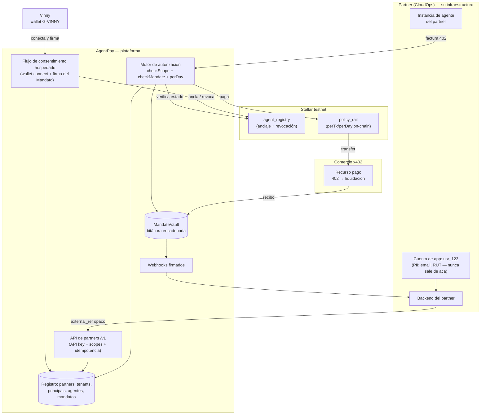
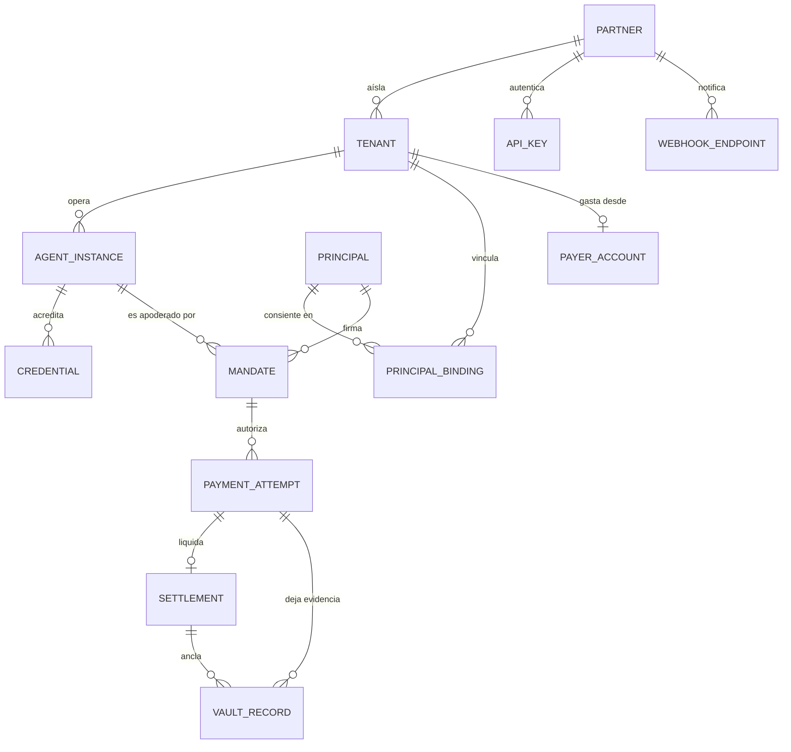
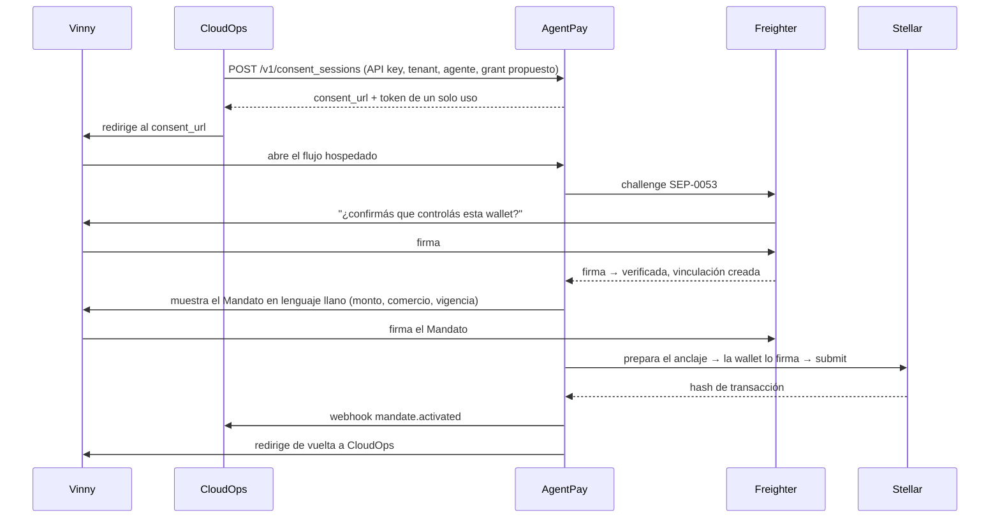

# Plataforma para partners — diseño, sin implementar

> **Estado: propuesta. Nada de este documento está construido.**
> Fecha: 2026-09-10 · Autor: Claude Code · Rama: `cc/diseno-plataforma-partners`
>
> Este documento **no** modifica ninguna decisión vigente, ningún contrato,
> ni `checkMandate`, `scope.limits`/`perDay`, MandateVault o la integración
> del bazaar. Es material para revisar y aprobar antes de que exista una
> línea de código.
>
> Contexto: [CONTEXTO.md](CONTEXTO.md) · Bitácora: [BITACORA.md](BITACORA.md) ·
> Decisiones de la fase: [DECISIONES.md](DECISIONES.md) ·
> Decisión de arranque: [../DECISIONES.md § P-6](../DECISIONES.md)

**Convención de este documento.** Cada afirmación sobre capacidades lleva
una de tres etiquetas, sin excepción:

| Etiqueta | Significa |
|---|---|
| `YA` | Implementado y verificado en el repo hoy, con archivo y línea |
| `PROP` | Propuesto en este documento, no existe |
| `DEC` | Requiere una decisión tuya antes de poder proponerse siquiera |

---

## 1. Resumen ejecutivo

**Qué hay hoy, verificado leyendo el código y no la documentación.** AgentPay
prueba, de punta a punta y contra Stellar testnet real, la cadena completa
de un pago agéntico: una wallet real (Freighter) demuestra que controla su
dirección con una firma SEP-0053; esa misma wallet firma su propio Mandato y
lo ancla on-chain; un agente con credencial AgentPass verificable pide una
factura x402 a un comercio real; el gasto pasa por dos autoridades
independientes (`checkScope` sobre la credencial, `checkMandate` sobre el
Mandato) más un límite diario; el pago lo liquida un smart account
`policy_rail` que vuelve a aplicar `perTx`/`perDay` dentro de la misma
transacción; y todo queda en una bitácora encadenada por hash en Postgres.
Eso funciona, está testeado (734 tests) y fue confirmado en el deploy real.

**Qué no hay, y es lo que separa el piloto de una plataforma.** Todo lo
anterior corre sobre **una sola identidad Stellar compartida**. Los dos
secretos que firman (`AGENT_SECRET_KEY`, `ISSUER_SECRET_KEY`) y el único
contrato `policy_rail` desplegado son los mismos para todos los visitantes
(`render.yaml`, `apps/web/src/server.ts:startSession`). No existe la noción
de partner: no hay tabla de partners, ni API key, ni scopes, ni idempotencia,
ni versionado, ni rate limiting, ni webhooks, ni OpenAPI — verificado con
una búsqueda sobre todo el repo, cero coincidencias. El paquete que resuelve
la derivación de llaves por tenant, `@agentpay/tenancy` (T32), **no está
importado por ningún archivo fuera de su propio paquete**: existe como
biblioteca, no como capacidad del producto. Y el `tenant_id` de hoy es
`sha256(dirección de la wallet)` (`apps/web/src/wallet-session.ts:walletTenantId`),
lo que significa que la misma wallet usada con dos partners distintos cae en
**el mismo tenant** — exactamente el modelo que el objetivo B2B2C prohíbe.

**Tres hallazgos que no estaban anotados en la documentación de la fase y
que cambian el orden del trabajo.**

1. **La sesión no es durable, el vault sí.** El Mandato y la credencial de
   cada visitante viven en un `Map` en memoria (`sessions`,
   `apps/web/src/server.ts`). Un redeploy de Render, o simplemente volver
   mañana, obliga a apretar "Iniciar sesión" otra vez, y eso **emite una
   credencial nueva y un Mandato nuevo**. El objetivo dice, literalmente,
   que renovar un mandato no debe crear un agente nuevo y que una sesión no
   debe crear identidad nueva. Hoy el sistema hace lo contrario, y no por un
   bug sino porque nunca hubo una tabla donde persistir esas entidades.
2. **El límite diario tiene un agujero de concurrencia entre procesos, no
   solo de escrituras.** `createPostgresMandateVault` carga todas las filas
   del tenant en memoria al construirse y responde `spentOn()` desde ese
   caché (`packages/vault/src/postgres-vault.ts`). Dos procesos sirviendo al
   mismo tenant ven, cada uno, un `spentToday` desactualizado, y el camino de
   cuenta clásica podría gastar por encima de `perDay`. El camino
   `policy_rail` no: ahí el límite lo aplica el contrato dentro de la
   transacción. Es decir, **la mitigación existente es el pagador on-chain**,
   y eso conviene tenerlo explícito antes de escalar a más de una instancia.
   `C-7` documenta la serialización de escrituras dentro del proceso; la
   lectura de totales no estaba anotada.
3. **Cualquier wallet conectada se registra sola como emisor usando la clave
   admin de la plataforma** (`ensureWalletIsRegisteredIssuer`,
   `apps/web/src/server.ts`; decisión `C-15`). En una demo de un visitante
   es razonable y está declarado como tal. En una plataforma con partners es
   un camino de escritura on-chain sin límite, pagado por la cuenta admin,
   accesible a cualquiera que conecte una wallet.

**La decisión de fondo que este documento no toma.** Todo lo demás —el
modelo de datos, la API, el onboarding— es trabajo acotado y de bajo riesgo.
Lo que gobierna el diseño entero es **quién firma el pago y quién tiene las
llaves** (sección 4.1). Hoy, de hecho, AgentPay custodia: la plataforma
tiene el secreto que gasta y el owner del `policy_rail`. Eso es aceptable en
testnet y está declarado, pero define el techo regulatorio del producto y no
puede resolverse "más adelante", porque cambia el modelo de entidades, el
onboarding y la superficie de API. Es la primera pregunta de la sección 7.

**Recomendación de arranque.** El primer hito implementable sin tocar
ninguna área restringida es la **capa de persistencia de partner/tenant/
agente/mandato** (sección 8): una migración, un paquete nuevo
`@agentpay/registry-datos`, y ninguna modificación a `checkMandate`, a los
contratos, al vault ni al camino de pago. Habilita todo lo demás y no
depende de la decisión de custodia.

---

## 2. Arquitectura objetivo

### 2.1 Diagrama de capas

### 2.2 Modelo de entidades

**Las distinciones que el modelo preserva, una por una.**

| Distinción pedida | Cómo la sostiene el modelo |
|---|---|
| `usr_123` es identidad de aplicación, no criptográfica | Vive solo en `TENANT.external_ref`, una cadena opaca. AgentPay nunca la interpreta ni la usa para autorizar nada |
| Tenant = partner + cliente/workspace | Clave única `(partner_id, external_ref)`. El tenant **no** se deriva de la wallet |
| Principal = quien consiente y revoca | `PRINCIPAL` es global por dirección Stellar; `PRINCIPAL_BINDING` lo ata a un tenant con su prueba de control |
| Agente técnico ≠ wallet | `AGENT_INSTANCE` tiene dirección propia, derivada, distinta de la del principal |
| Cuenta pagadora ≠ wallet principal | `PAYER_ACCOUNT` es una entidad aparte, con su propio `kind` (sección 4.1) |
| Una wallet, varios partners | Un `PRINCIPAL` con N filas en `PRINCIPAL_BINDING`, una por tenant. Tenants, agentes y mandatos separados |
| Un tenant, varios agentes | `TENANT 1—N AGENT_INSTANCE`, cada uno con su índice de derivación propio |
| Renovar un mandato no crea agente | `MANDATE.agent_id` apunta al agente existente; `MANDATE.supersedes_id` encadena la renovación |
| Una compra no crea identidad | `PAYMENT_ATTEMPT` cuelga del mandato, que cuelga del agente. Ningún camino de compra escribe en `AGENT_INSTANCE` |

### 2.3 Ciclo de vida de cada entidad

Estado actual entre corchetes. `YA` significa que la entidad existe hoy en
alguna forma, aunque no persistida.

| Entidad | Creación | Actualización | Revocación / expiración | Rotación | Eliminación |
|---|---|---|---|---|---|
| **Partner** `PROP` | Alta manual, fuera de banda (no hay self-serve en testnet) | Nombre, endpoints, límites | `suspended` corta todas sus API keys y frena pagos nuevos; no borra evidencia | — | Nunca borra: `archived`. La bitácora es la razón de ser del producto |
| **API key** `PROP` | Se genera al alta; se muestra una sola vez; se guarda solo el hash | Solo `scopes` y etiqueta | Revocación inmediata por id | Emitir la nueva, período de solapamiento, revocar la vieja | Duro, permitido: no hay evidencia atada a la key |
| **Tenant** `PROP` | El partner la crea vía API con `external_ref` opaco; recibe `tenant_index` monotónico y **nunca reusado** | Etiqueta, metadata no sensible | `suspended` (frena pagos, conserva historial) | El índice **no rota**: rotar cambiaría todas las llaves derivadas | Nunca borra. Borrado del `external_ref` a pedido, conservando el tenant |
| **Principal (wallet)** `YA` parcial | Primera prueba de control SEP-0053 (`verifyStellarMessage`, hoy en `/api/wallet/verify`) | — (una dirección es inmutable) | Desvincular de un tenant revoca sus mandatos en ese tenant | Wallet nueva = principal nuevo + mandato nuevo; el agente **no** cambia | Nunca borra |
| **Vinculación principal–tenant** `PROP` | Firma del challenge dentro del contexto de ese tenant | — | `revoked_at`; corta la capacidad de firmar mandatos nuevos ahí | — | Nunca borra |
| **Instancia de agente** `PROP` | El partner la pide para un tenant; se deriva su par de llaves (`deriveTenantKeypair`, `YA` como función) | Etiqueta, estado | `retired` — deja de poder pedir intents | Rotación de llave = índice nuevo + credencial nueva + mandato nuevo apuntando al **mismo** `agent_id` | Nunca borra |
| **Credencial** `YA` | `agentpass.issue()` + anclaje on-chain | Inmutable por definición (firmada) | `revoke()` on-chain, o `validUntil` | Reemisión con hash nuevo, ligada al mismo agente | Nunca borra |
| **Mandato** `YA` | Firmado por la wallet (SEP-0053) o la plataforma (JWS), anclado on-chain | Inmutable | `revoke` on-chain firmado por el principal, o `validUntil` | Renovación = mandato nuevo con `supersedes_id` | Nunca borra |
| **Cuenta pagadora** `YA` en forma compartida | Depende de la decisión de la sección 4.1 | Límites, según opción | Vaciado/cierre; `valid_until` en el caso `policy_rail` | **Hoy imposible en `policy_rail`: el contrato no tiene rotación de owner** (`DEC`, área restringida) | Cierre y barrido de saldo |
| **Intento de pago** `YA` sin persistir | Al recibir el 402 y autorizar | Solo transiciones de estado | — | — | Nunca borra |
| **Transacción / liquidación** `YA` | Respuesta del facilitador x402 | — | — | — | Nunca borra |
| **Registro de bitácora** `YA` | Append encadenado por hash | **Nunca** se actualiza | — | — | **Nunca** se borra: rompería la cadena |

### 2.4 Separación de datos

Tres compartimentos, con una regla por borde.

| Compartimento | Contiene | Regla |
|---|---|---|
| **Partner** | `usr_123`, email, RUT, perfil, todo lo que su producto necesite | Nunca cruza a AgentPay. El contrato de integración lo dice explícito, y la API **rechaza** `external_ref` que parezca email o RUT `PROP` |
| **Usuario** | Su clave privada, su semilla, su historial de wallet | Nunca sale de Freighter. Hoy `YA`: el servidor solo ve firmas, jamás un secreto |
| **AgentPay** | `partner_id`, `external_ref` opaco, dirección pública de la wallet, dirección del agente, parámetros del mandato, hashes, transacciones | Mínimo suficiente para autorizar y probar. Una dirección Stellar es un seudónimo público, no PII, pero **es correlacionable entre partners** — ver abajo |

**El punto incómodo, dicho de frente.** Si Vinny usa `G-VINNY` con CloudOps
y con otro partner, AgentPay puede ver que es la misma persona aunque nunca
reciba su email. La aislación de tenants impide que *los partners* se vean
entre sí, no que AgentPay correlacione. Mitigaciones posibles, ninguna
gratis: (a) declararlo en la política de privacidad y no explotarlo; (b)
guardar `sha256(partner_id || dirección)` como clave de búsqueda y la
dirección en claro solo donde la cadena la exige; (c) recomendar al usuario
una wallet por partner, lo que empeora la experiencia. `DEC`.

### 2.5 Onboarding y consentimiento

El requisito difícil no es firmar: es **volver desde otro navegador**. Hoy
la identidad de sesión es una cookie derivada de la wallet
(`walletTenantId`) y el estado vive en memoria, así que "volver" es
imposible en cualquier sentido real.

Diseño propuesto `PROP`: la cookie deja de ser la identidad y pasa a ser
solo transporte. La identidad es `(tenant, principal)` en Postgres. Volver
desde otro navegador = conectar la wallet, firmar un challenge nuevo, y el
servidor encuentra los mandatos vigentes de esa wallet en ese tenant. No se
emite nada nuevo.

Cuatro propiedades que este diseño compra y que un flujo dentro del partner
no compra: el consentimiento lo muestra AgentPay, así que el partner no
puede fabricarlo; el texto que firma la wallet es el mismo que se ancla; el
partner nunca ve la firma antes que la cadena; y la revocación tiene una
URL propia, alcanzable sin pasar por el partner — que es la mitad del
sentido de "revocable desde afuera del agente".

### 2.6 Modelo de integración: SDK, API hospedada o híbrido

| Alternativa | A favor | En contra | Veredicto |
|---|---|---|---|
| **Solo SDK** (cada partner hospeda todo) | Sin custodia, sin datos de terceros en AgentPay, sin costo de infraestructura | El consentimiento lo renderiza el partner: deja de ser prueba de nada. Cada partner necesita su Postgres, su seed, su deploy. Iterar exige que N partners actualicen | No |
| **Solo API hospedada** | Un solo lugar donde arreglar cosas, evidencia centralizada, integración en horas | El agente del partner tiene que hablar HTTP para cada paso; AgentPay se vuelve dependencia de disponibilidad | Insuficiente sola |
| **Híbrido** `PROP` **recomendado** | API hospedada para identidad, consentimiento, autorización y evidencia; SDK delgado que envuelve esa API y **además** trae local lo que ya es local y verificable (`checkScope`, `checkMandate`, verificación de credencial e intent) | Dos superficies que mantener sincronizadas | **Sí** |

**Por qué el híbrido y no otra cosa.** El proyecto ya está construido así:
`@agentpass/core`, `@agentpass/sdk`, `@agentpay/mandate` y el motor de
`apps/agent` son bibliotecas puras y verificables sin red — esa es la tesis
("verificable, no confiable"). Obligar a un partner a preguntarle a una API
si un Mandato es válido, cuando puede verificar la firma él mismo, tira esa
propiedad a la basura. Y a la inversa: el consentimiento y la bitácora sí
tienen que estar hospedados, porque su valor es justamente que no los
controla la parte interesada.

Reparto concreto propuesto: **hospedado** = alta de tenants y agentes,
consentimiento, custodia de llaves derivadas, decisión de autorización con
estado (`perDay`), bitácora, webhooks. **SDK local** = verificar credencial,
verificar Mandato, `checkScope`, `checkMandate`, armar el `PurchaseIntent`,
hablar x402. Un partner paranoico puede reverificar todo lo que AgentPay
afirma.

### 2.7 Contratos de API `PROP`

Nada de esto existe hoy: el repo no tiene una sola aparición de API key,
rate limit, webhook, idempotencia ni OpenAPI.

**Autenticación.** API key por partner, prefijo de ambiente
(`ap_test_...`), guardada como hash. En el header `Authorization: Bearer`.
Firma HMAC del cuerpo (`AgentPay-Signature`) opcional en testnet,
obligatoria antes de mainnet. Rechazo tipado con `AgentPassError` + `code`,
como todo el resto del proyecto.

**Scopes**, mínimos y separados por daño: `tenants:write`, `agents:write`,
`consent:create`, `mandates:read`, `mandates:revoke`, `payments:authorize`,
`vault:read`. Una key de solo lectura para el panel del partner nunca debe
poder gastar.

**Idempotencia.** Header `Idempotency-Key` obligatorio en todo `POST` que
mueva dinero o cree identidad. Se guarda `(partner_id, key) → respuesta`
con vencimiento de 24 h; repetir devuelve la misma respuesta, no una
segunda compra. Hoy no existe, y el `intentId` del vault cumple una función
parecida pero solo dentro del vault.

**Versionado.** Prefijo `/v1` para cambios rompientes, más un header
`AgentPay-Version: 2026-09-10` fijado por partner al alta, para cambios
aditivos. Sin versión, la versión del alta.

**Rate limiting.** Por partner y por ruta, ventana deslizante, `429` con
`Retry-After`. Los límites duros van en las rutas que tocan la cadena
(anclar, revocar, registrar emisor) porque ahí cada llamada cuesta dinero
real de la cuenta admin.

**Webhooks.** `mandate.activated`, `mandate.revoked`, `mandate.expiring`,
`payment.authorized`, `payment.refused`, `payment.settled`, `agent.retired`.
Firmados con secreto por endpoint, con timestamp y ventana de replay de
cinco minutos. Reintentos con backoff exponencial y una cola de fallidos
consultable.

**OpenAPI 3.1**, generado desde los esquemas zod que ya existen, no escrito
a mano — el criterio "todo dato que cruza un borde pasa por zod" ya deja el
esquema disponible; duplicarlo a mano garantiza que se desincronice.

### 2.8 El comercio x402

**Caso base: el comercio no integra nada.** `YA` verificado. El comercio
publica su recurso con x402 y responde `402` con sus `PaymentRequirements`.
AgentPay es, desde su punto de vista, un comprador cualquiera que paga y se
va. Todo el enforcement pasa del lado del comprador. Esto ya funciona
contra el bazaar real (`apps/agent/src/payment/x402.ts`), y es la propiedad
más valiosa del diseño: no hay que convencer a ningún comercio de nada.

**Caso opcional: el comercio quiere verificar la evidencia.** `PROP` Tres
niveles, de menos a más intrusivo:

1. **Recibo consultable.** `GET /v1/receipts/{tx_hash}` devuelve, sin
   autenticación, el hash del mandato, el hash de la credencial, el
   `intentId` y la posición en la cadena del vault. El comercio verifica
   contra la cadena por su cuenta.
2. **Encabezado de evidencia.** El comprador manda un
   `AgentPay-Evidence: <jws>` junto con el pago. El comercio, con el SDK o
   con `verifyStellarMessage` a mano, comprueba que un principal identificado
   consintió esa compra. Cero cambios en x402: es un header extra que un
   comercio que no lo entiende ignora.
3. **Verificación previa.** El comercio pregunta antes de servir. Lo
   menciono para descartarlo: agrega latencia y una dependencia de
   disponibilidad al camino crítico del comercio, a cambio de poco.

---

## 3. Flujo completo: Vinny → CloudOps → AgentPay → comercio

Cada paso marcado con lo que hoy existe y lo que falta.

| # | Paso | Hoy | Qué falta |
|---|---|---|---|
| 1 | Vinny se registra en CloudOps como `usr_123` | Fuera de alcance de AgentPay | — |
| 2 | CloudOps crea el tenant: `POST /v1/tenants` con `external_ref` opaco | `PROP` | Todo: tabla, API, autenticación |
| 3 | CloudOps crea la instancia de agente para ese tenant | `PROP` — la derivación existe (`deriveTenantKeypair`), sin usarse | Índice durable, persistencia, fondeo |
| 4 | CloudOps abre un `consent_session` y redirige a Vinny | `PROP` | Flujo hospedado, token de un solo uso, redirección |
| 5 | Vinny conecta `G-VINNY` y prueba control | `YA` — SEP-0053 verificado en servidor (`/api/wallet/verify`) | Atarlo a un tenant, no a una cookie |
| 6 | Vinny lee y firma el Mandato | `YA` — la wallet firma de verdad (T35) | Presentación por partner; texto del grant como parámetro |
| 7 | El Mandato se ancla on-chain | `YA` — `agent_registry`, firmado por la wallet | Persistir el resultado |
| 8 | CloudOps recibe la confirmación | `PROP` | Webhooks |
| 9 | El agente de CloudOps pide un recurso y recibe un `402` | `YA` contra el bazaar real | Generalizar más allá de un producto y un asset |
| 10 | AgentPay verifica identidad, mandato, destinatario, monto, vigencia, revocación y límites | `YA` — las siete, `checkScope` + `checkMandate` + `checkDailyLimit` + `reconcileTerms` + estado on-chain | Que la decisión tenga estado durable entre procesos |
| 11 | Se paga | `YA` — `policy_rail` liquida con `perTx`/`perDay` on-chain | Una cuenta pagadora por tenant, no una compartida |
| 12 | Queda evidencia encadenada | `YA` — MandateVault en Postgres | Consultable por partner y por principal, con permisos |
| 13 | Vinny ve su historial y revoca | `YA` la revocación firmada por wallet; el historial **exige una sesión viva en memoria** | Historial durable, alcanzable desde otro navegador |

---

## 4. Decisiones abiertas

### 4.1 La decisión crítica: fondos y autonomía

**No decido esto. Presento las cuatro opciones que pediste, con lo que
encontré leyendo el contrato y el SDK, y una recomendación al final que
necesita tu aprobación explícita.**

Punto de partida honesto: **hoy AgentPay es custodial de facto.** La
plataforma tiene `AGENT_SECRET_KEY`, que es quien paga en el camino clásico,
y tiene el owner del único `policy_rail` desplegado. El usuario no pone
fondos: los pone el proyecto. Es coherente con un piloto de testnet y está
declarado (`C-11`, `C-16`), pero no es una posición neutral de la que
partir.

---

**Opción 1 — `G-VINNY` firma cada pago.**

- *Experiencia*: pop-up de Freighter en cada compra. El agente no puede
  actuar mientras Vinny duerme.
- *Quién firma*: Vinny, siempre.
- *Llaves*: todas de Vinny. AgentPay no tiene ninguna.
- *Límites reales*: AgentPay puede negarse a pedir la firma, pero **no puede
  impedir** que Vinny firme otra cosa. El límite es asesoría, no enforcement.
- *Riesgos*: custodia nula, recuperación = la de su wallet, fraude acotado a
  que aprobó lo que aprobó, revocación trivial (deja de firmar).
- *Regulatorio*: el más limpio posible. Sin custodia, sin intermediación de
  fondos.
- *Compatibilidad con la tesis*: **la contradice**. Es el patrón de Meta
  Muse, que `P-6` clasificó como demanda de mercado y no como competidor
  precisamente porque pide aprobación humana en cada compra. Si el producto
  hace esto, no hay agente autónomo que gobernar.

---

**Opción 2 — Vinny delega capacidad limitada a una clave o sesión.**

Acá hay un hallazgo técnico que cambia la opción: **Stellar no tiene
límites de gasto por firmante.** Los firmantes adicionales de una cuenta
clásica tienen *pesos y umbrales*, no montos. Agregar una "clave de sesión"
como firmante de `G-VINNY` le da poder sobre **todo** el saldo de esa
cuenta, no sobre una parte. Las variantes que sí acotan —una cuenta
intermedia con su propio saldo, o un smart account— son, literalmente, la
opción 3.

- *Experiencia*: firma una vez, el agente opera después. La mejor de las
  cuatro, si fuera implementable como suena.
- *Quién firma*: la clave delegada.
- *Llaves*: la delegada la tendría AgentPay o el partner.
- *Límites reales*: **ninguno a nivel de red**, salvo que se degrade a la
  opción 3. Es la trampa de esta opción.
- *Riesgos*: si la clave delegada se filtra, se pierde toda la cuenta.
- *Regulatorio*: ambiguo, y la ambigüedad es mala señal.
- *Compatibilidad*: aparenta encajar y no encaja. `PolicyRail` existe
  exactamente porque esto no se puede hacer nativo.

---

**Opción 3 — Vinny fondea un `policy_rail` (smart account) por tenant.**

- *Experiencia*: una firma para consentir, una transferencia para fondear.
  Después el agente opera solo, hasta el límite y hasta `valid_until`.
- *Quién firma*: la clave owner del rail, que hoy tendría AgentPay. El
  contrato decide si la firma cuenta.
- *Llaves*: Vinny mantiene `G-VINNY`; AgentPay tiene el owner del rail.
- *Límites reales*: **los únicos verdaderamente aplicados por la red**.
  `policy_rail.__check_auth` autoriza exactamente una llamada a `transfer`
  de su propio asset, con él mismo como `from`, y aplica `per_tx` y
  `per_day` dentro de la transacción. `YA` funcionando (T31).
- *Riesgos, y acá está lo que hay que mirar*: leyendo
  `contracts/policy-rail/src/lib.rs`, el contrato **no tiene función de
  retiro, ni de rotación de owner, ni de revocación**. Solo el owner puede
  mover fondos, y solo hacia un `transfer`. Consecuencia: si AgentPay tiene
  el owner, **Vinny no puede recuperar su propio dinero**, y si el owner se
  pierde, los fondos quedan atrapados hasta `valid_until`... y después
  también. Para un piloto de testnet con montos simbólicos es tolerable.
  Para fondos de terceros, no. Arreglarlo **toca un contrato — área
  restringida, requiere tu aprobación explícita antes de que se escriba una
  línea.**
- *Regulatorio*: intermedio. AgentPay opera una llave sobre fondos ajenos,
  aunque acotada por el contrato. Con retiro por parte del principal, se
  parece más a un no-custodial con límites; sin él, se parece a custodia.
- *Compatibilidad*: **es la tesis del proyecto, escrita en Rust.** "Dale a
  tu agente un presupuesto, no tus llaves."

---

**Opción 4 — AgentPay custodia una cuenta por tenant.**

- *Experiencia*: la más simple. Sin fondeo por parte del usuario.
- *Quién firma*: AgentPay, con la llave derivada del seed maestro (`T32`).
- *Llaves*: todas de AgentPay.
- *Límites reales*: solo los que AgentPay aplique en software. Si su código
  falla, no hay red que lo frene.
- *Riesgos*: máximos. Compromiso del seed maestro = todos los tenants a la
  vez. Recuperación depende del respaldo del seed. El fraude interno es
  posible por construcción.
- *Regulatorio*: el peor. Custodia de fondos de terceros. En Chile, es lo
  que `P-6` evita explícitamente al no formalizar la SpA todavía
  ("actividad 100% testnet, sin custodia de fondos reales de terceros"). Con
  fondos reales, cambia la categoría CMF aplicable.
- *Compatibilidad*: es lo que el producto hace **hoy** en testnet, y lo que
  su narrativa dice que no hay que hacer.

---

**Recomendación, sujeta a tu aprobación.** Opción 3 como modelo del
producto, con opción 4 explícitamente rotulada como "modo demo de testnet" y
apagable, y opción 1 disponible como modo de alta seguridad para partners
que lo pidan. La opción 2, descartada por lo que dice el protocolo de
Stellar, no por preferencia.

**Precondición no negociable de la opción 3 antes de cualquier fondo real:**
que el principal pueda retirar su saldo sin depender de AgentPay. Eso es un
cambio de contrato y **no lo propongo como trabajo hasta que lo apruebes**.

### 4.2 Decisiones abiertas menores

| # | Decisión | Opciones | Recomendación | Razón |
|---|---|---|---|---|
| D1 | Dónde vive el seed maestro | `.env.local` / gestor de secretos / KMS con derivación fuera de proceso | Gestor de secretos (Doppler o Infisical) ahora; KMS antes de mainnet | Lo que `C-3` ya anticipó. KMS antes de tiempo cuesta y no protege nada más en testnet |
| D2 | Quién emite la credencial del agente | La plataforma / el partner / el propio tenant | La plataforma, como hoy (`C-17`) | Que el partner emita significa que el partner acredita a su propio agente. Se pierde el tercero verificable |
| D3 | Alta automática de emisores on-chain | Automática como hoy (`C-15`) / por partner al alta / manual | Por partner: se registra el emisor del partner una vez, no una wallet por visitante | Hoy cualquier wallet dispara una escritura on-chain pagada por la clave admin |
| D4 | Namespace del `tenant_id` en el vault | `sha256(wallet)` como hoy / `partner_id:tenant_ulid` | `partner_id:tenant_ulid` | El actual colisiona entre partners. Migración: las filas viejas quedan bajo su id viejo, sin reescribir la cadena |
| D5 | Esta es Fase 6 o Fase 7 | Extender Fase 6 / abrir fase nueva | Extender Fase 6 | Sus etapas 2 y 3 documentadas (`CONTEXTO.md` §5) son literalmente esto |
| D6 | Correlación de una wallet entre partners | Aceptar y declarar / seudonimizar / una wallet por partner | Aceptar y declarar en testnet; reevaluar antes de mainnet | Las otras dos degradan la experiencia o la evidencia sin beneficio real en testnet |

---

## 5. Ya existe / falta / riesgo / fase propuesta

Áreas restringidas marcadas con 🔒: requieren tu aprobación explícita antes
de implementarse.

| # | Brecha | Evidencia concreta | Riesgo si no se resuelve | Depende de | Piloto o producción | Fase |
|---|---|---|---|---|---|---|
| G1 | Identidad técnica y pagador compartidos | `apps/web/src/server.ts` lee `AGENT_SECRET_KEY`/`ISSUER_SECRET_KEY` fijos; `render.yaml` los declara únicos; un solo `POLICY_RAIL_CONTRACT_ID` | Dos partners comparten fondos e identidad. El `perDay` de uno consume el del otro | G2, G3, 4.1 | Piloto ya | F4 |
| G2 | Tenant derivado solo de la wallet | `walletTenantId()` = `sha256(dirección)`, `apps/web/src/wallet-session.ts` | La misma wallet con dos partners cae en un solo tenant. Rompe el modelo B2B2C de raíz | G3 | Piloto ya | F2 |
| G3 | `@agentpay/tenancy` sin índice durable, sin gestión de seed, sin rotación, sin decisión de emisor | El paquete no está importado por **ningún** archivo fuera de sí mismo (verificado); `deriveTenantKeypair` recibe `tenantIndex` de quien la llame y nadie la llama | Un índice mal asignado o reusado hace colisionar llaves de tenants distintos | D1, D2 | Piloto ya | F2 → F4 |
| G4 | Vault y Postgres frente a varios procesos | `postgres-vault.ts` cachea todas las filas al construirse y responde `spentOn()` desde memoria; cola de escrituras solo intra-proceso (`C-7`) | **Con dos instancias, `perDay` se puede exceder en el camino de cuenta clásica.** El camino `policy_rail` está cubierto por el contrato | — | Producción; hoy mitigado por correr una sola instancia | F8 |
| G5 | `apps/web` no es una API de partners | Doce rutas, autenticación solo por cookie de sesión, cero apariciones de API key / rate limit / idempotencia / webhook / OpenAPI en todo el repo | Nadie puede integrar sin que le demos un navegador | G1, G2 | Piloto ya | F5 |
| G6 | Camino de comercio específico | `BAZAAR_VENUE_CONTRACT_ID` y `BAZAAR_USDC_ISSUER` fijos; `mapAsset` acepta solo `"USDC"`; `PAYABLE_PRODUCT_ID = "swap-risk-quote"` y `ROUTE_PARAMS` fijos en `server.ts` | Un comercio nuevo exige cambiar código | — | Piloto | F7 |
| G7 | Sesión no durable: cada inicio emite credencial y mandato nuevos | `sessions` es un `Map` en memoria; `startSession` emite y ancla en cada llamada | Viola dos requisitos del objetivo: renovar no debe crear agente, una sesión no debe crear identidad. Además gasta transacciones on-chain de más | G2 | Piloto ya | F2 → F3 |
| G8 | Historial y revocación exigen sesión viva | `/api/session/vault` y `/api/session/revoke` requieren `getSession(req)` | Vinny no puede ver ni revocar desde otro dispositivo tras un redeploy. Es la mitad del argumento de "revocable desde afuera" | G7 | Piloto ya | F3 |
| G9 | 🔒 `policy_rail` sin retiro ni rotación de owner | `contracts/policy-rail/src/lib.rs`: solo `__check_auth` sobre `transfer`; no hay `withdraw`, ni `set_owner`, ni `revoke` | Con fondos de un tercero, el principal no puede recuperarlos. Bloqueante duro para mainnet | 4.1 | Producción | F6 / F10 |
| G10 | 🔒 Alta automática de emisores con la clave admin | `ensureWalletIsRegisteredIssuer` (`C-15`) | Escritura on-chain sin límite, pagada por la cuenta admin, disparable por cualquiera | D3 | Piloto | F5 |
| G11 | Postgres sin verificación de CA | `ssl: { rejectUnauthorized: false }` (`C-12`) | Cifrado sí, autenticación del servidor no | — | Producción | F8 |
| G12 | Estado de wallet-connect en memoria | `walletChallenges` y `pendingWalletSessions` son `ExpiringStore` en proceso | Con más de una instancia, conectar la wallet falla de forma intermitente | G4 | Producción | F8 |
| G13 | Sin PII pero sin contrato que lo garantice | No existe ningún campo `external_ref` todavía | Un partner mandará un email en cuanto pueda, salvo que la API lo rechace | G5 | Piloto | F2 |
| G14 | Mainnet, fiat, tarjetas, custodia | Sin alcance, por `CLAUDE.md` y `P-6` | — | 4.1, G9 | — | F10, solo evaluación |

---

## 6. Plan por fases

Numeración de hitos continua desde T36. Cada fase cierra con revisión tuya
antes de encadenar la siguiente, como el resto del proyecto.

**Tipos de aprobación:** ⚪ técnica (mostrar y seguir) · 🟡 de producto
(decisión tuya antes de arrancar) · 🔴 restringida (área protegida por
`CLAUDE.md`; no se escribe una línea sin tu sí explícito).

---

### F1 · Arquitectura y decisiones de producto 🟡

- **Objetivo llano.** Ponerse de acuerdo en qué se construye antes de
  construirlo.
- **Alcance.** Este documento; tus respuestas a la sección 7; las decisiones
  4.1 y 4.2 escritas en `DECISIONES.md` con prefijo `C-`.
- **Fuera de alcance.** Todo el código.
- **Decisiones previas.** Ninguna.
- **Entregables.** Este archivo; entradas nuevas en `DECISIONES.md`;
  actualización de `CONTEXTO.md` §5 y `ROADMAP.md` §4.6.
- **Evidencia.** Las decisiones, escritas y fechadas.
- **Riesgos.** Diseñar de más y que la primera integración real lo tire
  abajo. Mitigación: F2 arranca chico y no depende de 4.1.
- **Listo cuando.** Las siete preguntas están respondidas y las decisiones,
  registradas.

---

### F2 · Modelo partner/tenant y persistencia ⚪

- **Objetivo llano.** Que AgentPay sepa quiénes son sus partners y sus
  clientes, y no se olvide al reiniciar.
- **Alcance.** Paquete nuevo `@agentpay/registry-datos`: migraciones y
  repositorios para partner, api_key, tenant, principal, vinculación,
  instancia de agente, credencial, mandato. Asignación durable de
  `tenant_index`, monotónica y sin reuso. Validación de `external_ref` que
  rechaza lo que parezca email o RUT.
- **Fuera de alcance.** Derivar o usar llaves. Tocar `apps/web`. Cualquier
  API pública. El vault.
- **Decisiones previas.** D4 y D5.
- **Entregables.** El paquete, sus migraciones, sus tests.
- **Evidencia.** Tests de unicidad `(partner_id, external_ref)`, de no reuso
  del índice bajo escrituras concurrentes, y de rechazo de PII. `evidencia/T37.md`.
- **Riesgos.** Bajo. No toca ningún camino de autorización.
- **Listo cuando.** Se pueden crear dos partners con la misma wallet como
  principal y quedan en tenants distintos, con índices distintos, demostrado
  por un test.

---

### F3 · Onboarding y consentimiento reutilizable ⚪🟡

- **Objetivo llano.** Que Vinny firme una vez y pueda volver mañana, desde
  otro navegador, a ver su historial o revocar.
- **Alcance.** Persistir credencial y mandato contra el tenant; rehidratar la
  sesión desde Postgres tras probar control de la wallet; historial y
  revocación alcanzables sin sesión en memoria; renovación de mandato con
  `supersedes_id`, sin crear agente nuevo.
- **Fuera de alcance.** Llaves por tenant. API de partners. Cambiar quién
  firma.
- **Decisiones previas.** F2 cerrada; D3.
- **Entregables.** Rehidratación; endpoints de historial y revocación
  atados a `(tenant, principal)`; renovación.
- **Evidencia.** Firmar, reiniciar el proceso, volver en otro navegador, ver
  el historial y revocar — corrido contra testnet y grabado en `evidencia/`.
- **Riesgos.** Medio: toca el camino que arma los documentos firmados, y
  `C-17` ya demostró que ahí un error rompe todas las compras. Mitigación:
  el invariante ya es un test (T36); no se relaja.
- **Listo cuando.** El ciclo completo funciona sin que se emita ninguna
  credencial ni mandato nuevo al volver.

---

### F4 · Identidad técnica por tenant y llaves 🟡

- **Objetivo llano.** Que cada tenant tenga su propio agente y su propia
  cuenta, en vez de compartir una con todos.
- **Alcance.** Cablear `@agentpay/tenancy` (T32) usando el índice de F2;
  seed maestro en un gestor de secretos; fondeo con Friendbot; pantalla que
  explique el USDC de testnet; procedimiento de rotación **documentado**.
- **Fuera de alcance.** 🔴 Cualquier cambio a `policy_rail`. Rotación
  automática. Custodia de fondos reales.
- **Decisiones previas.** 4.1 y D1 resueltas.
- **Entregables.** Derivación cableada; los dos secretos fijos, eliminados
  del camino de producto.
- **Evidencia.** Dos tenants comprando en paralelo desde cuentas distintas,
  con `perDay` independiente, verificado en el explorador de testnet.
- **Riesgos.** Alto de operación: un seed mal guardado pierde todas las
  cuentas. Un índice mal asignado hace colisionar tenants.
- **Listo cuando.** `AGENT_SECRET_KEY` ya no participa de ninguna compra.

---

### F5 · API y SDK para partners ⚪🟡

- **Objetivo llano.** Que CloudOps integre leyendo documentación, sin
  hablar con nosotros.
- **Alcance.** `/v1` con API keys, scopes, idempotencia, rate limiting,
  webhooks firmados, OpenAPI generado desde zod, SDK cliente. Resolver G10
  (registro de emisor por partner, no por wallet).
- **Fuera de alcance.** Publicación a npm. Cobro. Panel de partner.
- **Decisiones previas.** F2, F3, F4 cerradas; D2, D3.
- **Entregables.** La API, el SDK, la especificación, una guía de
  integración con comandos exactos.
- **Evidencia.** Un partner ficticio integrado de punta a punta usando solo
  la documentación pública, sin tocar el repo.
- **Riesgos.** Congelar una superficie pública antes de tener un integrador
  real. Mitigación: marcar `/v1` como inestable hasta el piloto de F9.
- **Listo cuando.** Existe un `curl` que crea un tenant, abre un
  consentimiento y consulta un mandato.

---

### F6 · Cuenta pagadora autónoma por tenant 🔴

- **Objetivo llano.** Que el dinero salga de una cuenta del cliente con
  límites que aplica la red, no de una cuenta nuestra.
- **Alcance.** Depende enteramente de 4.1. Si es la opción 3: un
  `policy_rail` por tenant, con su ciclo de vida y su flujo de fondeo.
- **Fuera de alcance hasta tu aprobación explícita.** 🔴 Cualquier cambio a
  `contracts/policy-rail` — incluido el retiro por parte del principal (G9),
  que considero precondición de fondos reales pero **no propongo construir
  todavía**.
- **Decisiones previas.** 4.1 resuelta; G9 aprobada o explícitamente
  diferida.
- **Entregables.** Despliegue por tenant, fondeo, monitoreo de saldo.
- **Evidencia.** Un pago por tenant, con el rechazo del segundo por
  `per_day` visible en la respuesta del contrato.
- **Riesgos.** Los más altos del plan: fondos atrapados, costo de despliegue
  por tenant, límite de rent de Soroban.
- **Listo cuando.** Dos tenants gastan de rails distintos y el exceso lo
  rechaza el contrato, no el software.

---

### F7 · Comercio x402 genérico ⚪

- **Objetivo llano.** Que un comercio nuevo se agregue por configuración.
- **Alcance.** Registro de comercios (venue, assets, descubrimiento) como
  datos; varios assets con issuer explícito; recibo consultable
  (§2.8 nivel 1).
- **Fuera de alcance.** Aflojar el fallo cerrado de `mapAsset`. Comercios sin
  x402.
- **Decisiones previas.** F5 cerrada.
- **Entregables.** Adaptador genérico; el bazaar como una fila de
  configuración, no como código.
- **Evidencia.** Dos comercios en el catálogo, uno de ellos comprando de
  verdad.
- **Riesgos.** Generalizar de más y perder el fallo cerrado que hoy protege
  el mapeo de assets.
- **Listo cuando.** Agregar un comercio no toca ningún archivo `.ts`.

---

### F8 · Hardening: seguridad, privacidad, observabilidad ⚪

- **Objetivo llano.** Que aguante más de un proceso y que se pueda ver qué
  pasa.
- **Alcance.** G4 (leer `spentOn` de la base con la transacción, no del
  caché), G11 (CA de Postgres), G12 (estado de wallet-connect compartido),
  logs estructurados, métricas, alertas, política de retención.
- **Fuera de alcance.** 🔴 Cambiar el algoritmo de decisión de
  `checkMandate` o `checkScope`. La corrección de G4 debe cambiar **de dónde
  se lee el total**, no qué se hace con él.
- **Decisiones previas.** Ninguna.
- **Entregables.** Lo anterior, más una prueba de carga de dos instancias.
- **Evidencia.** Dos procesos compitiendo por el mismo `perDay` y el
  segundo rechazado correctamente.
- **Riesgos.** Es el hito con más chance de introducir un bug de
  autorización sin querer. Revisión línea por línea del diff.
- **Listo cuando.** Dos instancias corren sin exceder `perDay` ni romper la
  cadena del vault.

---

### F9 · Piloto externo en testnet 🟡

- **Objetivo llano.** Que alguien que no somos nosotros lo use.
- **Alcance.** Un partner real, un caso de compra real, soporte, medición.
- **Fuera de alcance.** Mainnet, fondos reales, cobro.
- **Decisiones previas.** Quién es el partner y cuál es la métrica de éxito
  (preguntas 2 y 6).
- **Entregables.** Integración viva, guía de incorporación, informe.
- **Evidencia.** Compras del partner, en su tenant, con su evidencia.
- **Riesgos.** Que el partner desaparezca. Mitigación: dos candidatos.
- **Listo cuando.** El partner completó el flujo sin nuestra intervención
  manual.

---

### F10 · Evaluación de mainnet 🔴

- **Objetivo llano.** Decidir, con datos, si tiene sentido cruzar.
- **Alcance.** **Solo evaluación, cero implementación.** Categoría CMF
  aplicable, custodia, seguro, auditoría de contratos, revisión de cada
  decisión que asumió testnet como entorno de bajo riesgo.
- **Fuera de alcance.** Todo lo que sea construir para mainnet.
- **Decisiones previas.** F9 cerrada con resultados.
- **Entregables.** Un informe y una recomendación.
- **Riesgos.** Cruzar por entusiasmo y no por evidencia.
- **Listo cuando.** Existe una decisión escrita, en cualquier dirección.

---

## 7. Preguntas que necesito que respondas

Solo las que cambian una decisión material. Sin ellas, F1 no cierra.

1. **¿AgentPay es no custodial, custodial o híbrido?** Es la que gobierna
   todo el resto (§4.1). Recuerdo que hoy, de hecho, es custodial en testnet.
2. **¿Cuál es el primer partner y cuál la primera compra?** ¿El bazaar del
   embajador, un equipo de hackathon, otro? La respuesta define qué se
   generaliza en F7 y qué no hace falta generalizar.
3. **¿API/SDK administrado por nosotros, o software que cada partner
   hospeda?** Recomiendo híbrido (§2.6). Cambia el modelo de negocio y quién
   guarda los datos.
4. **¿Un tenant representa una persona, un workspace o una empresa?**
   CloudOps con 500 usuarios: ¿son 500 tenants o uno con 500 principals?
   Cambia el modelo de datos y el costo por tenant en F6.
5. **¿Qué pasa cuando alguien conecta varias wallets?** ¿Varios principals
   en un tenant, cada wallet su propio tenant, o una wallet primaria?
6. **¿Cuál es la métrica de éxito del piloto en testnet?** ¿Cantidad de
   compras, partners integrados, tiempo de integración, cero incidentes de
   autorización?
7. **¿Qué condiciones tienen que cumplirse antes de siquiera considerar
   mainnet?** Propongo como mínimo: G9 resuelto, auditoría externa de los
   dos contratos, categoría CMF definida y una decisión de custodia. Falta
   tu criterio.

---

## 8. Primer hito recomendado

**F2 — el modelo de datos de partner/tenant, como paquete nuevo.**

**Por qué este y no otro.**

- **No toca ninguna área restringida.** Ni `checkMandate`, ni
  `scope.limits`/`perDay`, ni los contratos, ni MandateVault, ni el bazaar.
  Es un paquete nuevo en `packages/`, sin importar nada de `apps/`.
- **No depende de la decisión de custodia.** Partners, tenants y principals
  existen igual en las cuatro opciones de §4.1. Se puede construir mientras
  se piensa la decisión difícil.
- **Desbloquea todo lo demás.** F3, F4 y F5 dependen de que exista un
  `tenant_index` durable. Nada serio avanza sin esto.
- **Sigue el patrón que el proyecto ya validó.** `@agentpay/tenancy` (T32)
  se construyó igual: paquete puro, sin leer entorno, sin depender de una
  app, testeado solo.
- **Cierra la brecha más barata de arreglar ahora y más cara después.** G2
  (`tenant_id` = `sha256(wallet)`) ya está escrito en filas reales de
  `vault_records`. Cada semana que pasa hay más filas bajo el esquema viejo.

**Lo que no haría en ese hito:** cablearlo a `apps/web`. Que el paquete
exista y esté testeado es un hito; conectarlo cambia el comportamiento de la
app y merece su propia revisión.

**Aprobación que requiere:** ⚪ técnica, más tu respuesta a D4 (formato del
`tenant_id`) y D5 (si esto es Fase 6 o Fase 7).
